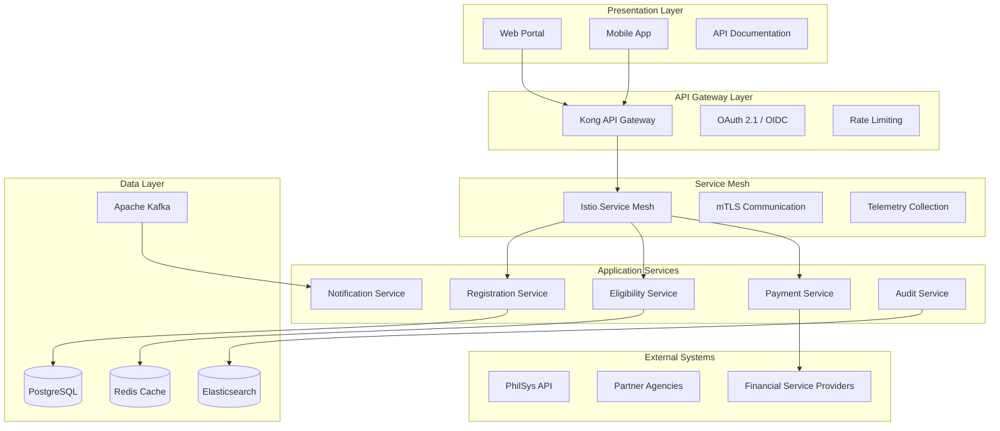
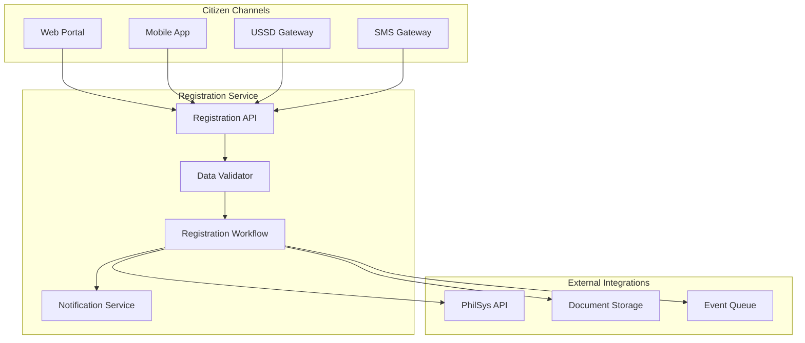
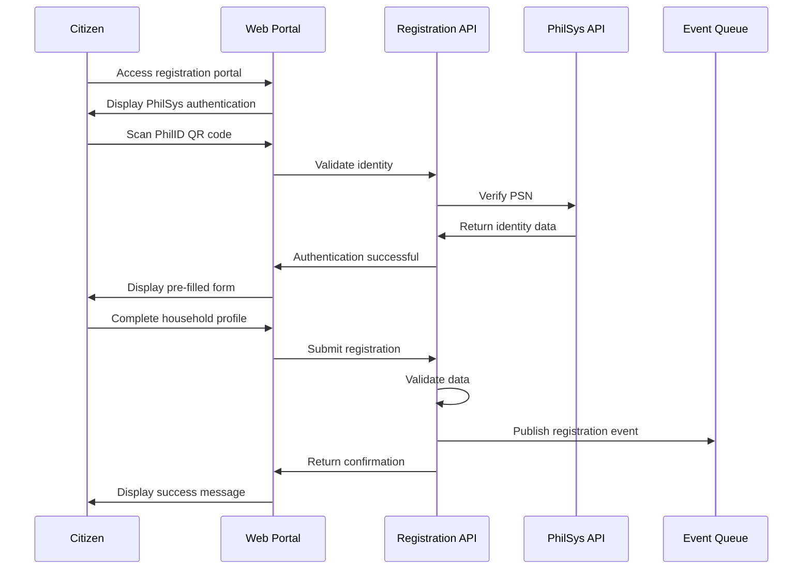

# Philippine Dynamic Social Registry (DSR)
## Comprehensive Technical Architecture and Implementation Guide

[](https://www.gnu.org/licenses/gpl-3.0)
[](https://github.com/Kirachon/DSR)
[](https://github.com/Kirachon/DSR)

---

**Document Version:** 3.0 (Production-Ready Edition)
**Publication Date:** December 20, 2024
**Last Updated:** December 20, 2024
**Project Sponsor:** Department of Social Welfare and Development (DSWD)
**Geographic Context:** Republic of the Philippines
**License:** GNU General Public License v3.0

---

## Executive Summary

The Philippine Dynamic Social Registry (DSR) represents a transformative leap in social protection delivery, moving from static, periodic assessments to a real-time, responsive system that adapts to citizens' changing circumstances. This comprehensive technical guide provides production-ready architecture, implementation patterns, and operational procedures for deploying a world-class dynamic social registry system.

Built on modern cloud-native principles with zero-trust security architecture, the DSR leverages containerization with Podman, microservices orchestration with Kubernetes, and comprehensive observability to ensure scalable, secure, and maintainable operations. This document serves as the definitive technical reference for government agencies, system integrators, and development teams implementing dynamic social protection systems.

### Key Features

- **Real-time Responsiveness**: Dynamic updates to citizen circumstances trigger immediate eligibility reassessments
- **Zero-Trust Security**: Comprehensive security architecture following NIST SP 800-207 guidelines
- **Cloud-Native Design**: Containerized microservices with Podman and Kubernetes orchestration
- **Production-Ready**: Complete with monitoring, logging, error handling, and operational procedures
- **Interoperable**: Standards-based APIs following OpenAPI 3.1 and Philippine Government Interoperability Framework
- **Privacy-First**: Built-in compliance with Data Privacy Act and international privacy standards

---

## Table of Contents

- [1. Introduction and Vision](#1-introduction-and-vision)
  - [1.1 The Imperative for Change](#11-the-imperative-for-change)
  - [1.2 Vision and Mission Statement](#12-vision-and-mission-statement)
  - [1.3 Guiding Principles](#13-guiding-principles)
  - [1.4 Key Stakeholders](#14-key-stakeholders)
  - [1.5 Success Metrics](#15-success-metrics)

- [2. System Architecture](#2-system-architecture)
  - [2.1 Architectural Overview](#21-architectural-overview)
  - [2.2 Cloud-Native Microservices Architecture](#22-cloud-native-microservices-architecture)
  - [2.3 Technology Stack](#23-technology-stack)
  - [2.4 Architectural Patterns](#24-architectural-patterns)
  - [2.5 System Integration Patterns](#25-system-integration-patterns)

- [3. Core Modules and Services](#3-core-modules-and-services)
  - [3.1 Citizen Engagement & Registration Service](#31-citizen-engagement--registration-service)
  - [3.2 Unified Data Management Service](#32-unified-data-management-service)
  - [3.3 Eligibility & Recommendation Engine](#33-eligibility--recommendation-engine)
  - [3.4 Agency Interoperability Service](#34-agency-interoperability-service)
  - [3.5 Payment & Disbursement Service](#35-payment--disbursement-service)
  - [3.6 Grievance Management Service](#36-grievance-management-service)
  - [3.7 Analytics & Reporting Service](#37-analytics--reporting-service)

- [4. Data Architecture and Governance](#4-data-architecture-and-governance)
  - [4.1 Data Governance Framework](#41-data-governance-framework)
  - [4.2 Master Data Management](#42-master-data-management)
  - [4.3 Data Quality and Validation](#43-data-quality-and-validation)
  - [4.4 Data Privacy and Protection](#44-data-privacy-and-protection)

- [5. Security Architecture](#5-security-architecture)
  - [5.1 Zero-Trust Security Model](#51-zero-trust-security-model)
  - [5.2 Identity and Access Management](#52-identity-and-access-management)
  - [5.3 Data Encryption and Protection](#53-data-encryption-and-protection)
  - [5.4 Security Monitoring and Incident Response](#54-security-monitoring-and-incident-response)

- [6. API Design and Integration](#6-api-design-and-integration)
  - [6.1 API Architecture and Standards](#61-api-architecture-and-standards)
  - [6.2 Authentication and Authorization](#62-authentication-and-authorization)
  - [6.3 Rate Limiting and Throttling](#63-rate-limiting-and-throttling)
  - [6.4 Error Handling and Response Codes](#64-error-handling-and-response-codes)

- [7. Containerization and Orchestration](#7-containerization-and-orchestration)
  - [7.1 Podman Containerization Strategy](#71-podman-containerization-strategy)
  - [7.2 Kubernetes Orchestration](#72-kubernetes-orchestration)
  - [7.3 Service Mesh with Istio](#73-service-mesh-with-istio)
  - [7.4 Container Security Best Practices](#74-container-security-best-practices)

- [8. Deployment and Operations](#8-deployment-and-operations)
  - [8.1 Infrastructure as Code](#81-infrastructure-as-code)
  - [8.2 CI/CD Pipeline](#82-cicd-pipeline)
  - [8.3 Environment Management](#83-environment-management)
  - [8.4 Backup and Disaster Recovery](#84-backup-and-disaster-recovery)

- [9. Monitoring and Observability](#9-monitoring-and-observability)
  - [9.1 Monitoring Strategy](#91-monitoring-strategy)
  - [9.2 Logging and Audit Trails](#92-logging-and-audit-trails)
  - [9.3 Performance Monitoring](#93-performance-monitoring)
  - [9.4 Alerting and Incident Management](#94-alerting-and-incident-management)

- [10. Implementation Roadmap](#10-implementation-roadmap)
  - [10.1 Phased Implementation Strategy](#101-phased-implementation-strategy)
  - [10.2 Risk Management](#102-risk-management)
  - [10.3 Change Management](#103-change-management)
  - [10.4 Training and Capacity Building](#104-training-and-capacity-building)

- [11. Troubleshooting and Maintenance](#11-troubleshooting-and-maintenance)
  - [11.1 Common Issues and Solutions](#111-common-issues-and-solutions)
  - [11.2 Performance Optimization](#112-performance-optimization)
  - [11.3 Maintenance Procedures](#113-maintenance-procedures)
  - [11.4 Upgrade Strategies](#114-upgrade-strategies)

- [Appendices](#appendices)
  - [A. Comprehensive Data Schemas](#a-comprehensive-data-schemas)
  - [B. Complete API Specifications](#b-complete-api-specifications)
  - [C. Configuration Templates](#c-configuration-templates)
  - [D. Security Checklists](#d-security-checklists)
  - [E. Glossary of Terms](#e-glossary-of-terms)

---

# 1. Introduction and Vision

## 1.1 The Imperative for Change

The Philippine social protection landscape has evolved significantly over the past decades, with programs like the Pantawid Pamilyang Pilipino Program (4Ps) serving millions of Filipino families. However, the traditional approach using static registries like Listahanan presents fundamental challenges in today's rapidly changing socio-economic environment:

### Current System Limitations

**Static Assessment Cycles**
- Household assessments occur every 3-5 years, creating significant gaps in data currency
- Economic shocks, natural disasters, and life events occur between assessment periods
- Beneficiary status becomes outdated, leading to targeting errors

**Exclusion and Inclusion Errors**
- **Type I Errors (Exclusion)**: Eligible households not receiving benefits due to outdated assessments
- **Type II Errors (Inclusion)**: Ineligible households continuing to receive benefits
- Estimated 15-20% targeting error rate in current systems

**Limited Responsiveness**
- Cannot adapt quickly to economic crises (e.g., COVID-19 pandemic impact)
- Disaster response requires separate, parallel registration systems
- New vulnerable populations remain invisible to the system

### The Dynamic Registry Solution

The Dynamic Social Registry (DSR) addresses these challenges through:

- **Real-time Updates**: Continuous data refresh through multiple channels
- **Event-driven Processing**: Automatic eligibility reassessment based on life events
- **Predictive Analytics**: Early identification of households at risk
- **Integrated Response**: Single system for regular programs and emergency response

### Alignment with National Policies

The DSR implementation aligns with key national frameworks:

- **Philippine Development Plan 2023-2028**: Calls for adaptive social protection systems
- **Digital Transformation Strategy**: Promotes government digital services
- **Ambisyon Natin 2040**: Vision of prosperous, predominantly middle-class society
- **Sustainable Development Goals**: Particularly SDG 1 (No Poverty) and SDG 10 (Reduced Inequalities)

## 1.2 Vision and Mission Statement

### Vision
To establish a world-class, dynamic, and integrated national social registry that empowers the Government of the Philippines to deliver timely, targeted, and dignified social protection to all Filipinos, fostering resilience and inclusive growth while ensuring no one is left behind.

### Mission
To build and operate a secure, interoperable, and citizen-centric dynamic social registry that:
- Provides real-time visibility into household welfare status
- Enables proactive and responsive social protection delivery
- Facilitates evidence-based policy making
- Promotes transparency and accountability in social programs
- Upholds the highest standards of data privacy and security

## 1.3 Guiding Principles

### Core Design Principles

**1. Citizen-Centricity**
- User experience designed from the citizen's perspective
- Multiple access channels (digital, physical, assisted)
- Transparent processes and clear communication
- Respect for dignity and privacy

**2. Data Integrity and Security**
- Single source of truth anchored on PhilSys
- Zero-trust security architecture
- End-to-end encryption for sensitive data
- Comprehensive audit trails

**3. Real-time Responsiveness**
- Event-driven architecture for immediate updates
- Automated eligibility reassessment
- Rapid deployment of emergency assistance
- Continuous system availability (99.9% uptime target)

**4. Interoperability**
- Standards-based API design (OpenAPI 3.1)
- Compliance with Philippine Government Interoperability Framework
- Seamless integration with partner agency systems
- Data sharing agreements and governance

**5. Scalability and Performance**
- Cloud-native architecture supporting millions of users
- Horizontal scaling capabilities
- Performance optimization for high-volume transactions
- Efficient resource utilization

**6. Privacy by Design**
- Data minimization principles
- Purpose limitation and consent management
- Regular privacy impact assessments
- Compliance with Data Privacy Act (R.A. 10173)

## 1.4 Key Stakeholders

### Primary Stakeholders

**Citizens and Households**
- Role: Primary beneficiaries and data subjects
- Responsibilities: Provide accurate information, report changes
- Rights: Access to services, data privacy, grievance redress

**Department of Social Welfare and Development (DSWD)**
- Role: System owner and primary operator
- Responsibilities: Policy setting, system governance, service delivery
- Authority: Data stewardship, program management

### Government Partners

**Philippine Statistics Authority (PSA)**
- Role: Identity verification through PhilSys
- Integration: Real-time identity validation services
- Data sharing: Demographic and civil registration data

**Department of Information and Communications Technology (DICT)**
- Role: Technical infrastructure and standards
- Services: GovCloud hosting, cybersecurity, interoperability framework
- Support: Technical guidance and compliance monitoring

**Local Government Units (LGUs)**
- Role: Frontline service delivery and community validation
- Responsibilities: Assisted registration, local program implementation
- Capabilities: Community knowledge, local presence

### Partner Agencies

**National Government Agencies (NGAs)**
- Department of Health (DOH): Health program integration
- Department of Education (DepEd): Education assistance programs
- Department of Agriculture (DA): Agricultural support programs
- Department of Labor and Employment (DOLE): Livelihood programs

**Financial Service Providers (FSPs)**
- Banks and e-wallet providers for cash transfer delivery
- Integration through secure payment APIs
- Compliance with financial regulations

### External Stakeholders

**Civil Society Organizations**
- Community-based organizations
- Advocacy groups
- Service delivery partners

**Development Partners**
- World Bank, Asian Development Bank
- Technical assistance and funding support
- Knowledge sharing and best practices

## 1.5 Success Metrics

### Key Performance Indicators

**System Performance**
- System availability: ≥99.9%
- Response time: <2 seconds for standard queries
- Data accuracy: ≥95%
- User satisfaction: ≥4.0/5.0

**Program Effectiveness**
- Targeting accuracy: ≥85%
- Coverage of eligible population: ≥90%
- Time to benefit delivery: <30 days
- Grievance resolution: <15 days

**Operational Efficiency**
- Cost per beneficiary: Reduce by 20%
- Processing time: Reduce by 50%
- Manual interventions: <5% of transactions
- Data quality score: ≥90%

---

# 2. System Architecture

## 2.1 Architectural Overview

The Philippine Dynamic Social Registry employs a modern, cloud-native architecture designed for scalability, security, and maintainability. The system is built on microservices principles, containerized with Podman, and orchestrated using Kubernetes on the Philippine Government Cloud (GovCloud) infrastructure.

### Architectural Principles

**Cloud-Native Design**
- Containerized applications using Podman for security and portability
- Kubernetes orchestration for automated deployment and scaling
- Service mesh architecture with Istio for advanced traffic management
- Infrastructure as Code (IaC) for consistent deployments

**Microservices Architecture**
- Domain-driven design with bounded contexts
- Independent service deployment and scaling
- Fault isolation and resilience patterns
- Technology diversity where appropriate

**Event-Driven Architecture**
- Asynchronous communication between services
- Event sourcing for audit trails and data consistency
- Real-time processing of citizen life events
- Eventual consistency patterns

## 2.2 Cloud-Native Microservices Architecture

### System Layers



### Microservices Benefits

**Scalability**
- Independent scaling based on service demand
- Horizontal scaling with Kubernetes HPA (Horizontal Pod Autoscaler)
- Resource optimization per service requirements
- Load balancing across service instances

**Resilience**
- Fault isolation prevents cascade failures
- Circuit breaker patterns for external dependencies
- Graceful degradation of non-critical services
- Automated recovery and self-healing

**Development Velocity**
- Independent service development and deployment
- Technology stack flexibility per service
- Parallel development by different teams
- Faster time-to-market for new features

**Operational Excellence**
- Service-specific monitoring and alerting
- Granular logging and tracing
- Independent service updates and rollbacks
- Blue-green and canary deployment strategies

## 2.3 Technology Stack

### Core Infrastructure

| Component | Technology | Version | Rationale |
|-----------|------------|---------|-----------|
| **Container Runtime** | Podman | 4.8+ | Rootless, daemonless containers for enhanced security |
| **Orchestration** | Kubernetes | 1.30+ | Industry-standard container orchestration |
| **Service Mesh** | Istio | 1.20+ | Advanced traffic management and security |
| **Cloud Platform** | DICT GovCloud | Latest | National mandate, data sovereignty |

### Application Stack

| Component | Technology | Version | Rationale |
|-----------|------------|---------|-----------|
| **Backend Framework** | Spring Boot | 3.2+ | Enterprise Java with comprehensive security |
| **Frontend Framework** | Next.js | 14+ | React-based with SSR and performance optimization |
| **Mobile Framework** | React Native | 0.73+ | Cross-platform mobile development |
| **API Gateway** | Kong Gateway | 3.5+ | Enterprise-grade API management |

### Data and Messaging

| Component | Technology | Version | Rationale |
|-----------|------------|---------|-----------|
| **Primary Database** | PostgreSQL | 16+ | ACID compliance, JSON support, reliability |
| **Cache Layer** | Redis | 7.2+ | High-performance caching and session storage |
| **Search Engine** | Elasticsearch | 8.11+ | Full-text search and analytics |
| **Message Broker** | Apache Kafka | 3.6+ | Event streaming and service communication |
| **Time Series DB** | InfluxDB | 2.7+ | Metrics and monitoring data |

### DevOps and Monitoring

| Component | Technology | Version | Rationale |
|-----------|------------|---------|-----------|
| **CI/CD** | GitLab CI/CD | 16+ | Integrated DevOps platform |
| **GitOps** | ArgoCD | 2.9+ | Declarative continuous deployment |
| **Package Manager** | Helm | 3.13+ | Kubernetes application packaging |
| **Monitoring** | Prometheus | 2.48+ | Metrics collection and alerting |
| **Visualization** | Grafana | 10.2+ | Metrics dashboards and visualization |
| **Tracing** | Jaeger | 1.52+ | Distributed tracing and performance monitoring |
| **Log Management** | ELK Stack | 8.11+ | Centralized logging and analysis |

## 2.4 Architectural Patterns

### Design Patterns

**Domain-Driven Design (DDD)**
- Bounded contexts for each business domain
- Aggregate roots for data consistency
- Domain events for cross-service communication
- Ubiquitous language across teams

**Command Query Responsibility Segregation (CQRS)**
- Separate read and write models
- Optimized query performance
- Event sourcing for audit trails
- Eventual consistency handling

**Saga Pattern**
- Distributed transaction management
- Compensation actions for rollbacks
- Choreography-based coordination
- Resilience to partial failures

**Circuit Breaker Pattern**
- Protection against cascading failures
- Automatic recovery mechanisms
- Fallback strategies for degraded service
- Health check integration

### Security Patterns

**Zero Trust Architecture**
- Never trust, always verify principle
- Micro-segmentation of network traffic
- Continuous authentication and authorization
- Least privilege access controls

**Defense in Depth**
- Multiple layers of security controls
- Network, application, and data security
- Monitoring and incident response
- Regular security assessments

## 2.5 System Integration Patterns

### Internal Service Communication

**Synchronous Communication**
- REST APIs for request-response patterns
- GraphQL for flexible data queries
- gRPC for high-performance service calls
- OpenAPI 3.1 specifications

**Asynchronous Communication**
- Event-driven messaging with Kafka
- Publish-subscribe patterns
- Event sourcing for state changes
- Dead letter queues for error handling

### External System Integration

**API-First Approach**
- Standardized API contracts
- Version management and backward compatibility
- Rate limiting and throttling
- Comprehensive API documentation

**Data Integration Patterns**
- ETL processes for batch data synchronization
- Change data capture (CDC) for real-time updates
- Data validation and quality checks
- Error handling and retry mechanisms

# 7. Containerization and Orchestration

## 7.1 Podman Containerization Strategy

### Why Podman Over Docker

The DSR adopts Podman as the primary containerization technology, providing significant security and operational advantages over traditional Docker deployments:

**Security Advantages**
- **Rootless Containers**: Containers run without root privileges, reducing attack surface
- **Daemonless Architecture**: No central daemon process eliminates single point of failure
- **User Namespace Isolation**: Enhanced process isolation and security boundaries
- **SELinux Integration**: Native support for mandatory access controls

**Operational Benefits**
- **Systemd Integration**: Native systemd service management for containers
- **Pod Support**: Kubernetes-compatible pod specifications
- **OCI Compliance**: Full compatibility with Open Container Initiative standards
- **Resource Efficiency**: Lower memory footprint and faster startup times

### Podman Configuration

#### Base Container Images

```dockerfile
# Production-ready base image for Java services
FROM registry.access.redhat.com/ubi9/openjdk-17:1.18

# Security hardening
USER 1001
WORKDIR /opt/app

# Copy application artifacts
COPY --chown=1001:1001 target/dsr-service.jar app.jar
COPY --chown=1001:1001 config/ config/

# Health check configuration
HEALTHCHECK --interval=30s --timeout=10s --start-period=60s --retries=3 \
  CMD curl -f http://localhost:8080/actuator/health || exit 1

# Expose application port
EXPOSE 8080

# Run as non-root user
ENTRYPOINT ["java", "-jar", "app.jar"]
```

#### Podman Build Configuration

```bash
#!/bin/bash
# build-container.sh - Production container build script

set -euo pipefail

# Build configuration
IMAGE_NAME="dsr/registration-service"
IMAGE_TAG="${CI_COMMIT_SHA:-latest}"
REGISTRY="registry.govcloud.ph"

# Security scanning
echo "Building container image..."
podman build \
  --tag "${IMAGE_NAME}:${IMAGE_TAG}" \
  --tag "${IMAGE_NAME}:latest" \
  --security-opt label=disable \
  --cap-drop ALL \
  --cap-add NET_BIND_SERVICE \
  --no-cache \
  .

# Security scanning with Trivy
echo "Scanning for vulnerabilities..."
trivy image --exit-code 1 --severity HIGH,CRITICAL "${IMAGE_NAME}:${IMAGE_TAG}"

# Push to registry
echo "Pushing to registry..."
podman push "${IMAGE_NAME}:${IMAGE_TAG}" "${REGISTRY}/${IMAGE_NAME}:${IMAGE_TAG}"
podman push "${IMAGE_NAME}:latest" "${REGISTRY}/${IMAGE_NAME}:latest"

echo "Container build and push completed successfully"
```

### Rootless Container Configuration

#### User Setup

```bash
# Configure rootless containers for service account
sudo useradd -m -s /bin/bash dsr-service
sudo usermod --add-subuids 100000-165535 dsr-service
sudo usermod --add-subgids 100000-165535 dsr-service

# Configure systemd for user services
sudo loginctl enable-linger dsr-service

# Switch to service user
sudo -u dsr-service bash

# Configure Podman for rootless operation
podman system migrate
podman info --debug
```

#### Systemd Service Configuration

```ini
# /home/dsr-service/.config/systemd/user/dsr-registration.service
[Unit]
Description=DSR Registration Service
After=network.target
Wants=network.target

[Service]
Type=notify
NotifyAccess=all
ExecStart=/usr/bin/podman run \
  --rm \
  --name dsr-registration \
  --publish 8080:8080 \
  --env-file /home/dsr-service/.config/dsr/registration.env \
  --volume dsr-logs:/opt/app/logs:Z \
  --security-opt label=disable \
  --cap-drop ALL \
  --read-only \
  --tmpfs /tmp \
  registry.govcloud.ph/dsr/registration-service:latest

ExecStop=/usr/bin/podman stop -t 30 dsr-registration
Restart=always
RestartSec=10

[Install]
WantedBy=default.target
```

### Container Security Best Practices

#### Security Configuration

```yaml
# podman-security-config.yaml
apiVersion: v1
kind: ConfigMap
metadata:
  name: podman-security-config
data:
  security.conf: |
    # Podman security configuration
    [containers]
    default_capabilities = []
    default_sysctls = []

    [engine]
    cgroup_manager = "systemd"
    events_logger = "journald"
    runtime = "crun"

    [network]
    default_network = "podman"
    network_backend = "netavark"

    [secrets]
    driver = "file"
```

#### Runtime Security Policies

```json
{
  "default": [
    {
      "type": "insecureAcceptAnything"
    }
  ],
  "transports": {
    "docker": {
      "registry.govcloud.ph": [
        {
          "type": "signedBy",
          "keyType": "GPGKeys",
          "keyPath": "/etc/pki/containers/govcloud-signing-key.gpg"
        }
      ]
    }
  }
}
```

## 7.2 Kubernetes Orchestration

### Cluster Architecture

```yaml
# kubernetes-cluster-config.yaml
apiVersion: v1
kind: ConfigMap
metadata:
  name: cluster-config
data:
  cluster.yaml: |
    apiVersion: kubeadm.k8s.io/v1beta3
    kind: ClusterConfiguration
    kubernetesVersion: v1.30.0
    clusterName: dsr-production

    controlPlaneEndpoint: "k8s-api.govcloud.ph:6443"

    networking:
      serviceSubnet: "10.96.0.0/12"
      podSubnet: "10.244.0.0/16"
      dnsDomain: "cluster.local"

    etcd:
      local:
        dataDir: "/var/lib/etcd"
        serverCertSANs:
        - "etcd.govcloud.ph"

    apiServer:
      advertiseAddress: "10.0.1.10"
      bindPort: 6443
      certSANs:
      - "k8s-api.govcloud.ph"
      - "10.0.1.10"

    controllerManager:
      bindAddress: "0.0.0.0"

    scheduler:
      bindAddress: "0.0.0.0"
```

### Pod Security Standards

```yaml
# pod-security-policy.yaml
apiVersion: v1
kind: Namespace
metadata:
  name: dsr-production
  labels:
    pod-security.kubernetes.io/enforce: restricted
    pod-security.kubernetes.io/audit: restricted
    pod-security.kubernetes.io/warn: restricted
---
apiVersion: networking.k8s.io/v1
kind: NetworkPolicy
metadata:
  name: dsr-network-policy
  namespace: dsr-production
spec:
  podSelector: {}
  policyTypes:
  - Ingress
  - Egress
  ingress:
  - from:
    - namespaceSelector:
        matchLabels:
          name: istio-system
    - namespaceSelector:
        matchLabels:
          name: dsr-production
  egress:
  - to:
    - namespaceSelector:
        matchLabels:
          name: dsr-production
  - to: []
    ports:
    - protocol: TCP
      port: 443
    - protocol: TCP
      port: 53
    - protocol: UDP
      port: 53
```

## 7.3 Service Mesh with Istio

### Istio Configuration

```yaml
# istio-config.yaml
apiVersion: install.istio.io/v1alpha1
kind: IstioOperator
metadata:
  name: dsr-control-plane
spec:
  values:
    global:
      meshID: dsr-mesh
      network: dsr-network

  components:
    pilot:
      k8s:
        resources:
          requests:
            cpu: 200m
            memory: 256Mi
          limits:
            cpu: 500m
            memory: 512Mi

    ingressGateways:
    - name: istio-ingressgateway
      enabled: true
      k8s:
        service:
          type: LoadBalancer
          ports:
          - port: 80
            targetPort: 8080
            name: http2
          - port: 443
            targetPort: 8443
            name: https

    egressGateways:
    - name: istio-egressgateway
      enabled: true

  meshConfig:
    defaultConfig:
      proxyStatsMatcher:
        inclusionRegexps:
        - ".*outlier_detection.*"
        - ".*circuit_breakers.*"
        - ".*upstream_rq_retry.*"
        - ".*_cx_.*"
        exclusionRegexps:
        - ".*osconfig.*"
```

### mTLS Configuration

```yaml
# mtls-policy.yaml
apiVersion: security.istio.io/v1beta1
kind: PeerAuthentication
metadata:
  name: default
  namespace: dsr-production
spec:
  mtls:
    mode: STRICT
---
apiVersion: security.istio.io/v1beta1
kind: AuthorizationPolicy
metadata:
  name: dsr-authz-policy
  namespace: dsr-production
spec:
  rules:
  - from:
    - source:
        principals: ["cluster.local/ns/dsr-production/sa/dsr-service-account"]
  - to:
    - operation:
        methods: ["GET", "POST", "PUT", "DELETE"]
  - when:
    - key: source.ip
      values: ["10.244.0.0/16"]
```

## 7.4 Container Security Best Practices

### Security Scanning Pipeline

```yaml
# .gitlab-ci.yml - Security scanning integration
stages:
  - build
  - security-scan
  - deploy

container-security-scan:
  stage: security-scan
  image: aquasec/trivy:latest
  script:
    - trivy image --exit-code 1 --severity HIGH,CRITICAL $CI_REGISTRY_IMAGE:$CI_COMMIT_SHA
    - trivy fs --exit-code 1 --severity HIGH,CRITICAL .
  artifacts:
    reports:
      container_scanning: trivy-report.json
  only:
    - main
    - develop
```

### Runtime Security Monitoring

```yaml
# falco-rules.yaml
apiVersion: v1
kind: ConfigMap
metadata:
  name: falco-rules
  namespace: falco-system
data:
  dsr_rules.yaml: |
    - rule: DSR Unauthorized Process
      desc: Detect unauthorized process execution in DSR containers
      condition: >
        spawned_process and
        container and
        k8s.ns.name = "dsr-production" and
        not proc.name in (java, sh, bash, curl, wget)
      output: >
        Unauthorized process in DSR container
        (user=%user.name command=%proc.cmdline container=%container.name)
      priority: WARNING

    - rule: DSR Sensitive File Access
      desc: Detect access to sensitive files in DSR containers
      condition: >
        open_read and
        container and
        k8s.ns.name = "dsr-production" and
        fd.name in (/etc/passwd, /etc/shadow, /etc/hosts)
      output: >
        Sensitive file access in DSR container
        (user=%user.name file=%fd.name container=%container.name)
      priority: ERROR
```

---

# 3. Core Modules and Services

The DSR system is composed of seven core microservices, each designed to handle specific business capabilities while maintaining loose coupling and high cohesion. Each service follows domain-driven design principles and implements comprehensive error handling, monitoring, and security controls.

## 3.1 Citizen Engagement & Registration Service

### Service Overview

The Citizen Engagement & Registration Service (CERS) serves as the primary interface for citizens to interact with the DSR system. It provides multiple channels for registration, updates, and life event reporting while ensuring a seamless user experience across all touchpoints.

### Architecture



### Key Features

**Multi-Channel Access**
- **Web Portal**: Responsive web application with progressive web app (PWA) capabilities
- **Mobile Application**: Native iOS and Android apps with offline synchronization
- **USSD Integration**: Feature phone access via telecommunications providers
- **SMS Gateway**: Basic registration and updates via text messaging
- **Assisted Registration**: LGU staff portal with bulk operations and case management

**PhilSys Integration**
- Real-time identity verification using PhilSys API
- QR code scanning for rapid authentication
- Biometric verification for high-security transactions
- Automatic demographic data population from PhilSys records

**Intelligent Data Collection**
- Progressive profiling to reduce form abandonment
- Smart defaults based on location and demographics
- Multi-language support (Filipino, English, regional languages)
- Accessibility compliance (WCAG 2.1 AA)

### Technical Implementation

#### Registration API Specification

```yaml
# registration-api.yaml
openapi: 3.1.0
info:
  title: DSR Registration Service API
  version: 3.0.0
  description: Citizen registration and profile management API

servers:
  - url: https://api.dsr.gov.ph/v3
    description: Production API

security:
  - OAuth2: [registration:write, profile:read]
  - ApiKey: []

paths:
  /registrations:
    post:
      summary: Create new household registration
      operationId: createRegistration
      tags: [Registration]
      requestBody:
        required: true
        content:
          application/json:
            schema:
              $ref: '#/components/schemas/RegistrationRequest'
      responses:
        '201':
          description: Registration created successfully
          content:
            application/json:
              schema:
                $ref: '#/components/schemas/RegistrationResponse'
        '400':
          description: Invalid request data
          content:
            application/json:
              schema:
                $ref: '#/components/schemas/ErrorResponse'
        '409':
          description: Duplicate registration detected
          content:
            application/json:
              schema:
                $ref: '#/components/schemas/ConflictResponse'

  /registrations/{registrationId}/life-events:
    post:
      summary: Report life event
      operationId: reportLifeEvent
      tags: [Life Events]
      parameters:
        - name: registrationId
          in: path
          required: true
          schema:
            type: string
            format: uuid
      requestBody:
        required: true
        content:
          application/json:
            schema:
              $ref: '#/components/schemas/LifeEventRequest'
      responses:
        '202':
          description: Life event accepted for processing
          content:
            application/json:
              schema:
                $ref: '#/components/schemas/LifeEventResponse'

components:
  schemas:
    RegistrationRequest:
      type: object
      required: [headOfHouseholdPsn, address, members]
      properties:
        headOfHouseholdPsn:
          type: string
          pattern: '^[0-9]{16}$'
          description: PhilSys Number of household head
        address:
          $ref: '#/components/schemas/Address'
        members:
          type: array
          items:
            $ref: '#/components/schemas/HouseholdMember'
          minItems: 1
          maxItems: 20
        economicProfile:
          $ref: '#/components/schemas/EconomicProfile'

    Address:
      type: object
      required: [region, province, municipality, barangay]
      properties:
        region:
          type: string
          enum: [NCR, CAR, I, II, III, IV-A, IV-B, V, VI, VII, VIII, IX, X, XI, XII, XIII, BARMM]
        province:
          type: string
          maxLength: 100
        municipality:
          type: string
          maxLength: 100
        barangay:
          type: string
          maxLength: 100
        streetAddress:
          type: string
          maxLength: 200
        zipCode:
          type: string
          pattern: '^[0-9]{4}$'
        coordinates:
          $ref: '#/components/schemas/GeoCoordinates'

    HouseholdMember:
      type: object
      required: [psn, relationshipToHead, birthDate]
      properties:
        psn:
          type: string
          pattern: '^[0-9]{16}$'
        relationshipToHead:
          type: string
          enum: [HEAD, SPOUSE, CHILD, PARENT, SIBLING, RELATIVE, NON_RELATIVE]
        birthDate:
          type: string
          format: date
        gender:
          type: string
          enum: [MALE, FEMALE, OTHER]
        civilStatus:
          type: string
          enum: [SINGLE, MARRIED, WIDOWED, SEPARATED, DIVORCED]
        educationLevel:
          type: string
          enum: [NO_FORMAL, ELEMENTARY, HIGH_SCHOOL, VOCATIONAL, COLLEGE, POST_GRADUATE]
        employmentStatus:
          type: string
          enum: [EMPLOYED, UNEMPLOYED, SELF_EMPLOYED, STUDENT, RETIRED, DISABLED]
        specialConditions:
          type: array
          items:
            type: string
            enum: [PWD, SENIOR_CITIZEN, PREGNANT, LACTATING, SOLO_PARENT, INDIGENOUS]
```

### Business Logic Implementation

```java
// RegistrationService.java
@Service
@Transactional
@Slf4j
public class RegistrationService {

    private final PhilSysClient philSysClient;
    private final RegistrationRepository registrationRepository;
    private final EventPublisher eventPublisher;
    private final ValidationService validationService;

    public RegistrationResponse createRegistration(RegistrationRequest request) {
        log.info("Processing registration for PSN: {}",
                 maskPsn(request.getHeadOfHouseholdPsn()));

        // Step 1: Validate PhilSys identity
        PhilSysValidationResult validation = philSysClient.validateIdentity(
            request.getHeadOfHouseholdPsn()
        );

        if (!validation.isValid()) {
            throw new InvalidIdentityException("PhilSys validation failed: " +
                                             validation.getErrorMessage());
        }

        // Step 2: Check for duplicate registrations
        Optional<Registration> existing = registrationRepository
            .findByHeadOfHouseholdPsn(request.getHeadOfHouseholdPsn());

        if (existing.isPresent()) {
            throw new DuplicateRegistrationException(
                "Registration already exists for PSN: " +
                maskPsn(request.getHeadOfHouseholdPsn())
            );
        }

        // Step 3: Validate household data
        ValidationResult validationResult = validationService.validateHousehold(request);
        if (!validationResult.isValid()) {
            throw new ValidationException("Household validation failed",
                                        validationResult.getErrors());
        }

        // Step 4: Create registration entity
        Registration registration = Registration.builder()
            .id(UUID.randomUUID())
            .headOfHouseholdPsn(request.getHeadOfHouseholdPsn())
            .address(mapAddress(request.getAddress()))
            .members(mapMembers(request.getMembers()))
            .economicProfile(mapEconomicProfile(request.getEconomicProfile()))
            .status(RegistrationStatus.PENDING_VERIFICATION)
            .createdAt(Instant.now())
            .build();

        // Step 5: Save registration
        Registration savedRegistration = registrationRepository.save(registration);

        // Step 6: Publish registration event
        RegistrationCreatedEvent event = RegistrationCreatedEvent.builder()
            .registrationId(savedRegistration.getId())
            .headOfHouseholdPsn(savedRegistration.getHeadOfHouseholdPsn())
            .timestamp(Instant.now())
            .build();

        eventPublisher.publish(event);

        log.info("Registration created successfully with ID: {}",
                 savedRegistration.getId());

        return mapToResponse(savedRegistration);
    }

    @EventListener
    public void handleLifeEvent(LifeEventReportedEvent event) {
        log.info("Processing life event: {} for registration: {}",
                 event.getEventType(), event.getRegistrationId());

        Registration registration = registrationRepository
            .findById(event.getRegistrationId())
            .orElseThrow(() -> new RegistrationNotFoundException(
                "Registration not found: " + event.getRegistrationId()));

        // Update registration based on life event
        switch (event.getEventType()) {
            case BIRTH:
                handleBirthEvent(registration, event);
                break;
            case DEATH:
                handleDeathEvent(registration, event);
                break;
            case EMPLOYMENT_CHANGE:
                handleEmploymentChangeEvent(registration, event);
                break;
            case ADDRESS_CHANGE:
                handleAddressChangeEvent(registration, event);
                break;
            default:
                log.warn("Unknown life event type: {}", event.getEventType());
        }

        // Trigger eligibility reassessment
        EligibilityReassessmentEvent reassessmentEvent =
            EligibilityReassessmentEvent.builder()
                .registrationId(registration.getId())
                .trigger(event.getEventType().toString())
                .timestamp(Instant.now())
                .build();

        eventPublisher.publish(reassessmentEvent);
    }

    private String maskPsn(String psn) {
        if (psn == null || psn.length() < 8) {
            return "****";
        }
        return psn.substring(0, 4) + "****" + psn.substring(psn.length() - 4);
    }
}
```

### User Experience Design

**Registration Workflow**



### Integration Points

- **PhilSys API**: Identity verification and demographic data
- **Document Storage Service**: Supporting document management
- **Notification Service**: SMS, email, and push notifications
- **Eligibility Service**: Automatic eligibility assessment
- **Audit Service**: Comprehensive activity logging
- **Grievance Service**: Issue reporting and resolution

---

#### **3.2 Module 2: Unified Central Database & Data Management (Pinag-isang Talaan)**

* **Overview:** To serve as the single source of truth, anchored on PhilSys, and manage the entire data lifecycle.  
* **Key Features:**  
  * **PhilSys Integration:** Real-time identity verification using the PhilSys API upon registration. The PSN is the primary key for all individual records.  
  * **Data Ingestion Engine:** Ingests data from Listahanan, i-Registro, and other legacy systems.  
  * **Data Validation & Cleaning:** Automated rules to check for data consistency, completeness, and accuracy.  
  * **De-duplication Logic:** Prevents the creation of duplicate individual or household records.  
  * **Historical Data Archiving:** Maintains a complete audit trail of all changes to a record.  
* **User Story:** "As a DSWD data steward, I need to see a complete history of changes to a household's profile to resolve a data dispute."  
* **Process Flow (Data Ingestion from Partner Agency):**  
  1. Partner agency sends data via a secure API.  
  2. Data is placed in a staging area.  
  3. Validation rules are applied.  
  4. Data is matched against existing records using PSN.  
  5. The Golden Record (See Chapter 4\) is updated based on trust rules.  
  6. The transaction is logged in the audit trail.  
* **Integration Points:** All other modules, PhilSys, Partner Agency Systems.

#### **3.3 Module 3: Eligibility & Recommendation Engine (Tulong-Suri)**

* **Overview:** To automate the assessment of eligibility for various social programs and proactively recommend services.  
* **Key Features:**  
  * **Proxy Means Test (PMT) Calculator:** Implements the official PMT formula to generate a welfare score for each household. The model can be updated as required.  
  * **Categorical Eligibility Rules:** Manages rules for programs targeting specific sectors (e.g., isSenior, isPWD, isSoloParent).  
  * **Program Matching:** Automatically matches households to programs for which they are potentially eligible based on their PMT score and categorical data.  
  * **Recommendation Generator:** Creates a "Recommended Services" list for each household profile, which can be viewed by the citizen and social workers.  
  * **Predictive Analytics (Future Phase):** Utilizes machine learning to identify households at risk of falling into poverty and trigger proactive alerts.  
* **User Story:** "As a social worker, when I view a household's profile, I want to see a list of all programs they are eligible for, so I can provide comprehensive assistance."  
* **Process Flow (Eligibility Check):**  
  1. A trigger is received (e.g., profile update, new program added).  
  2. The engine retrieves the household's latest data.  
  3. It runs the PMT calculation.  
  4. It checks the data against the rule sets for all available programs.  
  5. It generates a list of eligible and recommended programs.  
  6. The results are stored and displayed on the household's profile.  
* **Integration Points:** Module 1 (Registration), Module 2 (Database), Module 7 (Reporting).

#### **3.4 Module 4: Agency Interoperability & Service Tracking (Ugnayan)**

* **Overview:** To enable secure data sharing with partner agencies and track the delivery of all services to beneficiaries.  
* **Key Features:**  
  * **Secure API Gateway:** Provides RESTful APIs for authenticated partner agencies.  
  * **Data Sharing Agreement (DSA) Management:** A registry of all DSAs, with rules enforced by the API gateway.  
  * **Service Delivery Ledger:** An immutable log that records every service or benefit received by an individual or household.  
  * **Program Roster Generation:** Generates lists of eligible beneficiaries for specific programs.  
* **User Story:** "As a DOH staff member, I need to verify if a patient is an active 4Ps member to determine their eligibility for a health subsidy, and I need to do this in seconds."  
* **Process Flow (Service Delivery Reporting):**  
  1. Partner agency delivers a service (e.g., vaccination).  
  2. The agency's system calls the DSR's /logServiceDelivery API with the citizen's PSN and service details.  
  3. The DSR validates the API call.  
  4. The service is added to the citizen's immutable Service Delivery Ledger.  
  5. This new information can trigger a re-evaluation of needs or eligibility.  
* **Integration Points:** Module 2 (Database), Partner Agency Systems.

#### **3.5 Module 5: Integrated Payment & Disbursement (Tulong-Hatid)**

* **Overview:** To integrate with financial service providers for the secure and efficient delivery of cash-based assistance.  
* **Key Features:**  
  * **Financial Service Provider (FSP) Integration:** Connects with banks and e-wallets linked to the beneficiary's PhilSys account.  
  * **Payment Instruction Generation:** Creates payment files for FSPs based on program rosters.  
  * **Payment Reconciliation:** Automatically reconciles disbursement reports from FSPs against payment instructions.  
  * **Beneficiary Payment Preference:** Allows beneficiaries to choose their preferred mode of payment.  
* **User Story:** "As a DSWD finance officer, I need to generate a single payment file for all 4Ps beneficiaries in Cagayan and send it securely to the designated bank for disbursement."  
* **Integration Points:** Module 2 (Database), Module 3 (Eligibility), FSP systems.

#### **3.6 Module 6: Grievance Redress Mechanism (Aksyon-Tugon)**

* **Overview:** To provide a transparent, fair, and accessible system for handling appeals, complaints, and feedback.  
* **Key Features:**  
  * **Multi-Channel Case Filing:** Citizens can file a grievance via the web/mobile portal, at an LGU office, or through a hotline.  
  * **Automated Case Routing:** Grievances are automatically routed to the correct office based on the issue type and location.  
  * **Case Management Dashboard:** A dashboard for DSWD staff to track, manage, and resolve cases within set service-level agreements (SLAs).  
  * **Citizen Status Updates:** Provides real-time updates to citizens on the status of their filed grievance.  
* **User Story:** "I am a farmer whose application was denied. I want to file an appeal online and submit additional documents to prove my eligibility."  
* **Integration Points:** Module 1 (Registration), Module 2 (Database).

#### **3.7 Module 7: Analytics, Monitoring & Reporting (Ulat-Bayan)**

* **Overview:** To provide decision-makers with the data and tools needed for program monitoring, evaluation, and evidence-based policy formulation.  
* **Key Features:**  
  * **Real-time Dashboards:** Visual dashboards displaying key performance indicators (KPIs).  
  * **Custom Report Builder:** An intuitive tool for administrators to generate custom reports.  
  * **Geospatial Analysis:** Maps displaying poverty incidence, program coverage, and service gaps.  
  * **Data Export:** Securely export anonymized data for academic research and in-depth analysis.  
* **User Story:** "As the DSWD Secretary, I need a dashboard showing the real-time distribution of aid in disaster-affected areas to make strategic decisions on resource allocation."  
* **Integration Points:** Reads from a dedicated Data Warehouse populated by all other modules.

### **Chapter 4: Data Governance & Interoperability**

#### **4.1 The Data Governance Framework**

Data is the DSR's most critical asset. A formal governance framework will be established with:

* **Data Council:** A multi-agency body chaired by DSWD to set data policies.  
* **Data Stewards:** Assigned individuals responsible for the quality and lifecycle of specific data domains (e.g., Demographic Data, Program Data).  
* **Data Quality Rules:** Automated checks will be embedded in the system to ensure data is accurate, complete, and consistent.

#### **4.2 Master Data Management (MDM) & The Golden Record**

The DSR will implement MDM to create a **"Golden Record"** for every Filipino.

* The **PSN** is the unique master key.  
* When data is received from a partner agency, it is matched against the existing record.  
* A "trust score" algorithm will determine which source to prioritize in case of conflicting information, with citizen-provided data and PhilSys data having the highest trust.

#### **4.3 The Philippine Government Interoperability Framework (PGIF)**

All data exchange will strictly adhere to the standards defined by the DICT's PGIF, covering data formats, transport protocols, and security standards.

#### **4.4 API Strategy & Management**

* **Design:** All APIs will be RESTful, well-documented using the OpenAPI standard, and versioned.  
* **Security:** All API access will be secured using OAuth 2.0, requiring authenticated and authorized credentials from partner agency systems.  
* **Access Control:** The API Gateway will enforce policies defined in Data Sharing Agreements (DSAs), ensuring an agency can only access the specific data fields they are authorized to see.

### **Chapter 5: Security, Privacy, and Trust**

#### **5.1 A Zero-Trust Security Architecture**

The DSR will adopt a "never trust, always verify" model.

* **Micro-segmentation:** Network policies will prevent services from communicating with each other unless explicitly allowed.  
* **Strong Authentication:** Every request between services and from users will be authenticated and authorized.  
* **Continuous Monitoring:** Anomaly detection systems will monitor for suspicious activity in real-time.

#### **5.2 Upholding the Data Privacy Act (R.A. 10173\)**

* **Privacy by Design:** Privacy considerations are embedded into the system's design, not added as an afterthought.  
* **Consent Management:** A dedicated service will manage citizen consent. Citizens will have a dashboard to see which agencies have accessed their data and for what purpose, and can revoke consent at any time.  
* **Data Minimization:** APIs will be designed to only expose the absolute minimum data required for a transaction.  
* **Breach Notification:** A clear protocol for investigating and reporting any potential data breach will be in place, as mandated by law.

#### **5.3 Building Public Trust: Transparency and Accountability**

* **Transparency Portal:** A public-facing portal showing aggregated, anonymized data on program reach and effectiveness.  
* **Audit Trails:** Citizens can request an audit trail of who has viewed or modified their record.  
* **Community Validation:** Integrating a process, inspired by Rwanda's Ubudehe system, where local communities can help validate the poverty status of households in a fair and transparent manner, fostering ownership and accountability.

### **Chapter 6: Implementation Roadmap & Change Management**

#### **6.1 Phased Implementation Plan**

| Phase | Duration | Key Objectives & Milestones |
| :---- | :---- | :---- |
| **Phase 1: Foundation** | 12 Months | **Goal:** Establish the core platform. **Milestones:** Core infrastructure setup on GovCloud; Unified Database (Module 2\) live; Citizen Registration Portal (Module 1\) launched in pilot regions (e.g., Cagayan Valley); Grievance Module (Module 6\) operational. |
| **Phase 2: Integration** | 18 Months | **Goal:** Expand connectivity and intelligence. **Milestones:** Integration with 3 priority NGAs (DOH, DepEd, PhilHealth) via Ugnayan Module (Module 4); Eligibility Engine (Module 3\) live for 5 key programs; Payment Module (Module 5\) integrated with 2 FSPs; Analytics dashboards (Module 7\) deployed. |
| **Phase 3: Optimization** | Ongoing | **Goal:** Achieve national scale and proactive service delivery. **Milestones:** Nationwide rollout of all modules; Integration with 10+ NGAs; Predictive analytics for proactive recommendations implemented; Full integration with LGU systems. |

#### **6.2 Governance and Project Management Structure**

A Program Management Office (PMO) will be established under DSWD, with representatives from PSA, DICT, and other key agencies to oversee the implementation. Agile methodologies (Scrum/Kanban) will be used for development to ensure flexibility and continuous stakeholder feedback.

#### **6.3 Change Management & Communications Strategy**

* **For Government Staff (DSWD/LGU):** A comprehensive training program covering not just the new software, but the new, dynamic way of working.  
* **For the Public:** A multi-lingual, multi-channel public information campaign to explain the benefits of the DSR, how to register, and how their data is protected. This will be crucial for building trust and encouraging participation.

### **Appendices**

#### **Appendix A: Glossary of Terms**

* **DSR:** Dynamic Social Registry  
* **PhilSys:** Philippine Identification System  
* **PSN:** PhilSys Number  
* **API:** Application Programming Interface  
* **LGU:** Local Government Unit  
* **PMT:** Proxy Means Test  
* **CI/CD:** Continuous Integration/Continuous Delivery

# Appendices

## A. Comprehensive Data Schemas

### A.1 Core Entity Schemas

#### Household Profile Schema (JSON Schema Draft 2020-12)

```json
{
  "$schema": "https://json-schema.org/draft/2020-12/schema",
  "$id": "https://schemas.dsr.gov.ph/household-profile/v3.0.0",
  "title": "DSR Household Profile",
  "description": "Comprehensive household profile schema for the Philippine Dynamic Social Registry",
  "type": "object",
  "required": [
    "householdId",
    "headOfHouseholdPsn",
    "address",
    "members",
    "registrationDate",
    "status"
  ],
  "properties": {
    "householdId": {
      "type": "string",
      "pattern": "^HH-[0-9]{4}-[0-9]{8}$",
      "description": "Unique household identifier",
      "examples": ["HH-2024-00001234"]
    },
    "headOfHouseholdPsn": {
      "type": "string",
      "pattern": "^[0-9]{16}$",
      "description": "PhilSys Number of the household head",
      "examples": ["1234567890123456"]
    },
    "address": {
      "$ref": "#/$defs/Address"
    },
    "members": {
      "type": "array",
      "items": {
        "$ref": "#/$defs/HouseholdMember"
      },
      "minItems": 1,
      "maxItems": 20,
      "description": "List of household members"
    },
    "economicProfile": {
      "$ref": "#/$defs/EconomicProfile"
    },
    "socioEconomicScore": {
      "type": "number",
      "minimum": 0,
      "maximum": 100,
      "description": "Calculated socio-economic score based on PMT"
    },
    "eligibilityStatus": {
      "type": "object",
      "properties": {
        "overallStatus": {
          "type": "string",
          "enum": ["ELIGIBLE", "INELIGIBLE", "PENDING_ASSESSMENT", "UNDER_REVIEW"]
        },
        "programs": {
          "type": "array",
          "items": {
            "$ref": "#/$defs/ProgramEligibility"
          }
        },
        "lastAssessmentDate": {
          "type": "string",
          "format": "date-time"
        }
      },
      "required": ["overallStatus", "lastAssessmentDate"]
    },
    "registrationDate": {
      "type": "string",
      "format": "date-time",
      "description": "Date and time of initial registration"
    },
    "lastUpdated": {
      "type": "string",
      "format": "date-time",
      "description": "Date and time of last profile update"
    },
    "status": {
      "type": "string",
      "enum": ["ACTIVE", "INACTIVE", "SUSPENDED", "ARCHIVED"],
      "description": "Current status of the household profile"
    },
    "dataQuality": {
      "$ref": "#/$defs/DataQuality"
    },
    "auditTrail": {
      "type": "array",
      "items": {
        "$ref": "#/$defs/AuditEntry"
      },
      "description": "Audit trail of profile changes"
    }
  },
  "$defs": {
    "Address": {
      "type": "object",
      "required": ["region", "province", "municipality", "barangay"],
      "properties": {
        "region": {
          "type": "string",
          "enum": [
            "NCR", "CAR", "I", "II", "III", "IV-A", "IV-B",
            "V", "VI", "VII", "VIII", "IX", "X", "XI", "XII", "XIII", "BARMM"
          ],
          "description": "Philippine administrative region"
        },
        "province": {
          "type": "string",
          "maxLength": 100,
          "description": "Province name"
        },
        "municipality": {
          "type": "string",
          "maxLength": 100,
          "description": "Municipality or city name"
        },
        "barangay": {
          "type": "string",
          "maxLength": 100,
          "description": "Barangay name"
        },
        "streetAddress": {
          "type": "string",
          "maxLength": 200,
          "description": "Street address or house number"
        },
        "zipCode": {
          "type": "string",
          "pattern": "^[0-9]{4}$",
          "description": "4-digit postal code"
        },
        "coordinates": {
          "type": "object",
          "properties": {
            "latitude": {
              "type": "number",
              "minimum": -90,
              "maximum": 90
            },
            "longitude": {
              "type": "number",
              "minimum": -180,
              "maximum": 180
            },
            "accuracy": {
              "type": "number",
              "minimum": 0,
              "description": "GPS accuracy in meters"
            }
          },
          "required": ["latitude", "longitude"]
        },
        "addressType": {
          "type": "string",
          "enum": ["PERMANENT", "CURRENT", "TEMPORARY"],
          "default": "CURRENT"
        },
        "verificationStatus": {
          "type": "string",
          "enum": ["VERIFIED", "UNVERIFIED", "DISPUTED"],
          "default": "UNVERIFIED"
        }
      }
    },
    "HouseholdMember": {
      "type": "object",
      "required": ["psn", "relationshipToHead", "birthDate", "gender"],
      "properties": {
        "psn": {
          "type": "string",
          "pattern": "^[0-9]{16}$",
          "description": "PhilSys Number of the member"
        },
        "relationshipToHead": {
          "type": "string",
          "enum": [
            "HEAD", "SPOUSE", "CHILD", "PARENT", "GRANDPARENT",
            "GRANDCHILD", "SIBLING", "IN_LAW", "RELATIVE", "NON_RELATIVE"
          ]
        },
        "firstName": {
          "type": "string",
          "maxLength": 100,
          "description": "First name (from PhilSys)"
        },
        "middleName": {
          "type": "string",
          "maxLength": 100,
          "description": "Middle name (from PhilSys)"
        },
        "lastName": {
          "type": "string",
          "maxLength": 100,
          "description": "Last name (from PhilSys)"
        },
        "birthDate": {
          "type": "string",
          "format": "date",
          "description": "Date of birth"
        },
        "gender": {
          "type": "string",
          "enum": ["MALE", "FEMALE", "OTHER"]
        },
        "civilStatus": {
          "type": "string",
          "enum": ["SINGLE", "MARRIED", "WIDOWED", "SEPARATED", "DIVORCED", "LIVE_IN"]
        },
        "educationLevel": {
          "type": "string",
          "enum": [
            "NO_FORMAL_EDUCATION", "ELEMENTARY_UNDERGRADUATE", "ELEMENTARY_GRADUATE",
            "HIGH_SCHOOL_UNDERGRADUATE", "HIGH_SCHOOL_GRADUATE", "VOCATIONAL",
            "COLLEGE_UNDERGRADUATE", "COLLEGE_GRADUATE", "POST_GRADUATE"
          ]
        },
        "employmentStatus": {
          "type": "string",
          "enum": [
            "EMPLOYED_FULL_TIME", "EMPLOYED_PART_TIME", "SELF_EMPLOYED",
            "UNEMPLOYED", "STUDENT", "RETIRED", "DISABLED", "HOMEMAKER"
          ]
        },
        "occupation": {
          "type": "string",
          "maxLength": 100,
          "description": "Current occupation or job title"
        },
        "monthlyIncome": {
          "type": "number",
          "minimum": 0,
          "description": "Monthly income in Philippine Pesos"
        },
        "specialConditions": {
          "type": "array",
          "items": {
            "type": "string",
            "enum": [
              "PWD", "SENIOR_CITIZEN", "PREGNANT", "LACTATING",
              "SOLO_PARENT", "INDIGENOUS", "OVERSEAS_WORKER", "STUDENT"
            ]
          },
          "uniqueItems": true
        },
        "healthConditions": {
          "type": "array",
          "items": {
            "type": "object",
            "properties": {
              "condition": {
                "type": "string",
                "maxLength": 200
              },
              "severity": {
                "type": "string",
                "enum": ["MILD", "MODERATE", "SEVERE"]
              },
              "requiresAssistance": {
                "type": "boolean"
              }
            },
            "required": ["condition"]
          }
        },
        "isActive": {
          "type": "boolean",
          "default": true,
          "description": "Whether the member is currently part of the household"
        },
        "dateJoined": {
          "type": "string",
          "format": "date",
          "description": "Date the member joined the household"
        },
        "dateLeft": {
          "type": "string",
          "format": "date",
          "description": "Date the member left the household (if applicable)"
        }
      }
    },
    "EconomicProfile": {
      "type": "object",
      "properties": {
        "totalHouseholdIncome": {
          "type": "number",
          "minimum": 0,
          "description": "Total monthly household income in PHP"
        },
        "incomeSource": {
          "type": "array",
          "items": {
            "type": "object",
            "properties": {
              "source": {
                "type": "string",
                "enum": [
                  "EMPLOYMENT", "BUSINESS", "REMITTANCES", "GOVERNMENT_ASSISTANCE",
                  "PENSION", "INVESTMENTS", "AGRICULTURE", "OTHER"
                ]
              },
              "amount": {
                "type": "number",
                "minimum": 0
              },
              "frequency": {
                "type": "string",
                "enum": ["DAILY", "WEEKLY", "MONTHLY", "QUARTERLY", "ANNUALLY", "IRREGULAR"]
              }
            },
            "required": ["source", "amount", "frequency"]
          }
        },
        "assets": {
          "type": "object",
          "properties": {
            "landOwnership": {
              "type": "string",
              "enum": ["OWNED", "RENTED", "SHARED", "SQUATTER", "OTHER"]
            },
            "houseType": {
              "type": "string",
              "enum": [
                "CONCRETE", "SEMI_CONCRETE", "WOOD", "BAMBOO",
                "MAKESHIFT", "APARTMENT", "CONDOMINIUM"
              ]
            },
            "vehicles": {
              "type": "array",
              "items": {
                "type": "object",
                "properties": {
                  "type": {
                    "type": "string",
                    "enum": ["CAR", "MOTORCYCLE", "BICYCLE", "TRICYCLE", "JEEPNEY", "TRUCK"]
                  },
                  "year": {
                    "type": "integer",
                    "minimum": 1900,
                    "maximum": 2030
                  },
                  "estimatedValue": {
                    "type": "number",
                    "minimum": 0
                  }
                },
                "required": ["type"]
              }
            },
            "appliances": {
              "type": "array",
              "items": {
                "type": "string",
                "enum": [
                  "REFRIGERATOR", "WASHING_MACHINE", "AIR_CONDITIONER",
                  "TELEVISION", "COMPUTER", "SMARTPHONE", "RADIO"
                ]
              },
              "uniqueItems": true
            }
          }
        },
        "expenses": {
          "type": "object",
          "properties": {
            "food": {
              "type": "number",
              "minimum": 0
            },
            "housing": {
              "type": "number",
              "minimum": 0
            },
            "utilities": {
              "type": "number",
              "minimum": 0
            },
            "transportation": {
              "type": "number",
              "minimum": 0
            },
            "healthcare": {
              "type": "number",
              "minimum": 0
            },
            "education": {
              "type": "number",
              "minimum": 0
            },
            "other": {
              "type": "number",
              "minimum": 0
            }
          }
        }
      }
    },
    "ProgramEligibility": {
      "type": "object",
      "required": ["programCode", "status", "assessmentDate"],
      "properties": {
        "programCode": {
          "type": "string",
          "pattern": "^[A-Z0-9_]{3,20}$",
          "description": "Unique program identifier"
        },
        "programName": {
          "type": "string",
          "maxLength": 200
        },
        "status": {
          "type": "string",
          "enum": ["ELIGIBLE", "INELIGIBLE", "CONDITIONAL", "WAITLISTED"]
        },
        "score": {
          "type": "number",
          "minimum": 0,
          "maximum": 100,
          "description": "Eligibility score for the program"
        },
        "assessmentDate": {
          "type": "string",
          "format": "date-time"
        },
        "validUntil": {
          "type": "string",
          "format": "date-time"
        },
        "conditions": {
          "type": "array",
          "items": {
            "type": "string"
          },
          "description": "Conditions that must be met for eligibility"
        },
        "reason": {
          "type": "string",
          "maxLength": 500,
          "description": "Reason for eligibility status"
        }
      }
    },
    "DataQuality": {
      "type": "object",
      "properties": {
        "completenessScore": {
          "type": "number",
          "minimum": 0,
          "maximum": 100,
          "description": "Percentage of required fields completed"
        },
        "accuracyScore": {
          "type": "number",
          "minimum": 0,
          "maximum": 100,
          "description": "Data accuracy score based on validation rules"
        },
        "freshnessScore": {
          "type": "number",
          "minimum": 0,
          "maximum": 100,
          "description": "Data freshness score based on last update"
        },
        "validationErrors": {
          "type": "array",
          "items": {
            "type": "object",
            "properties": {
              "field": {
                "type": "string"
              },
              "error": {
                "type": "string"
              },
              "severity": {
                "type": "string",
                "enum": ["ERROR", "WARNING", "INFO"]
              }
            },
            "required": ["field", "error", "severity"]
          }
        }
      }
    },
    "AuditEntry": {
      "type": "object",
      "required": ["timestamp", "action", "userId"],
      "properties": {
        "timestamp": {
          "type": "string",
          "format": "date-time"
        },
        "action": {
          "type": "string",
          "enum": [
            "CREATED", "UPDATED", "DELETED", "VIEWED",
            "EXPORTED", "IMPORTED", "VERIFIED", "SUSPENDED"
          ]
        },
        "userId": {
          "type": "string",
          "description": "ID of the user who performed the action"
        },
        "userRole": {
          "type": "string",
          "description": "Role of the user who performed the action"
        },
        "changes": {
          "type": "object",
          "description": "Details of what was changed"
        },
        "reason": {
          "type": "string",
          "maxLength": 500,
          "description": "Reason for the action"
        },
        "ipAddress": {
          "type": "string",
          "format": "ipv4",
          "description": "IP address of the user"
        },
        "userAgent": {
          "type": "string",
          "description": "User agent string"
        }
      }
    }
  }
}
```

#### Service Delivery Log Schema

```json
{
  "$schema": "https://json-schema.org/draft/2020-12/schema",
  "$id": "https://schemas.dsr.gov.ph/service-delivery-log/v3.0.0",
  "title": "DSR Service Delivery Log",
  "description": "Comprehensive service delivery tracking schema",
  "type": "object",
  "required": [
    "logId",
    "psn",
    "householdId",
    "serviceCode",
    "providingAgency",
    "deliveryDate",
    "status"
  ],
  "properties": {
    "logId": {
      "type": "string",
      "pattern": "^SDL-[0-9]{4}-[0-9]{10}$",
      "description": "Unique service delivery log identifier",
      "examples": ["SDL-2024-0000123456"]
    },
    "psn": {
      "type": "string",
      "pattern": "^[0-9]{16}$",
      "description": "PhilSys Number of the beneficiary"
    },
    "householdId": {
      "type": "string",
      "pattern": "^HH-[0-9]{4}-[0-9]{8}$",
      "description": "Associated household identifier"
    },
    "serviceCode": {
      "type": "string",
      "pattern": "^[A-Z]{2,5}-[A-Z0-9]{2,10}-[0-9]{2}$",
      "description": "Standardized service code",
      "examples": ["DSWD-4PS-01", "DOH-VAX-02", "DEPED-ALS-01"]
    },
    "serviceName": {
      "type": "string",
      "maxLength": 200,
      "description": "Human-readable service name"
    },
    "serviceCategory": {
      "type": "string",
      "enum": [
        "CASH_TRANSFER", "HEALTH_SERVICE", "EDUCATION_ASSISTANCE",
        "LIVELIHOOD_SUPPORT", "DISASTER_RELIEF", "NUTRITION_PROGRAM",
        "HOUSING_ASSISTANCE", "SOCIAL_INSURANCE"
      ]
    },
    "providingAgency": {
      "type": "string",
      "enum": [
        "DSWD", "DOH", "DEPED", "DA", "DOLE", "DILG", "DOT", "DTI",
        "TESDA", "PCSO", "PAGCOR", "LGU", "NGO", "PRIVATE"
      ]
    },
    "implementingUnit": {
      "type": "string",
      "maxLength": 200,
      "description": "Specific office or unit that delivered the service"
    },
    "deliveryDate": {
      "type": "string",
      "format": "date-time",
      "description": "Date and time when service was delivered"
    },
    "deliveryMethod": {
      "type": "string",
      "enum": [
        "CASH", "IN_KIND", "VOUCHER", "DIGITAL_TRANSFER",
        "DIRECT_SERVICE", "REFERRAL", "TRAINING", "CONSULTATION"
      ]
    },
    "amount": {
      "type": "object",
      "properties": {
        "value": {
          "type": "number",
          "minimum": 0,
          "description": "Monetary value of the service"
        },
        "currency": {
          "type": "string",
          "enum": ["PHP", "USD"],
          "default": "PHP"
        }
      }
    },
    "quantity": {
      "type": "object",
      "properties": {
        "value": {
          "type": "number",
          "minimum": 0
        },
        "unit": {
          "type": "string",
          "maxLength": 50,
          "description": "Unit of measurement (e.g., kg, pieces, sessions)"
        }
      }
    },
    "location": {
      "type": "object",
      "properties": {
        "facilityName": {
          "type": "string",
          "maxLength": 200
        },
        "address": {
          "$ref": "https://schemas.dsr.gov.ph/household-profile/v3.0.0#/$defs/Address"
        },
        "coordinates": {
          "type": "object",
          "properties": {
            "latitude": {
              "type": "number",
              "minimum": -90,
              "maximum": 90
            },
            "longitude": {
              "type": "number",
              "minimum": -180,
              "maximum": 180
            }
          },
          "required": ["latitude", "longitude"]
        }
      }
    },
    "status": {
      "type": "string",
      "enum": ["DELIVERED", "PENDING", "CANCELLED", "FAILED", "PARTIAL"]
    },
    "beneficiaryFeedback": {
      "type": "object",
      "properties": {
        "rating": {
          "type": "integer",
          "minimum": 1,
          "maximum": 5,
          "description": "Service satisfaction rating (1-5 stars)"
        },
        "comments": {
          "type": "string",
          "maxLength": 1000
        },
        "feedbackDate": {
          "type": "string",
          "format": "date-time"
        }
      }
    },
    "verificationStatus": {
      "type": "string",
      "enum": ["VERIFIED", "UNVERIFIED", "DISPUTED", "UNDER_INVESTIGATION"]
    },
    "relatedServices": {
      "type": "array",
      "items": {
        "type": "string",
        "pattern": "^SDL-[0-9]{4}-[0-9]{10}$"
      },
      "description": "Related service delivery log IDs"
    },
    "metadata": {
      "type": "object",
      "properties": {
        "batchId": {
          "type": "string",
          "description": "Batch identifier for bulk service delivery"
        },
        "programCycle": {
          "type": "string",
          "description": "Program cycle or period identifier"
        },
        "fundingSource": {
          "type": "string",
          "maxLength": 200
        },
        "costCenter": {
          "type": "string",
          "maxLength": 100
        }
      }
    },
    "auditTrail": {
      "type": "array",
      "items": {
        "$ref": "https://schemas.dsr.gov.ph/household-profile/v3.0.0#/$defs/AuditEntry"
      }
    },
    "createdAt": {
      "type": "string",
      "format": "date-time"
    },
    "updatedAt": {
      "type": "string",
      "format": "date-time"
    }
  }
}
```

#### Program Configuration Schema

```json
{
  "$schema": "https://json-schema.org/draft/2020-12/schema",
  "$id": "https://schemas.dsr.gov.ph/program-config/v3.0.0",
  "title": "DSR Program Configuration",
  "description": "Social protection program configuration schema",
  "type": "object",
  "required": [
    "programCode",
    "programName",
    "ownerAgency",
    "eligibilityCriteria",
    "benefits",
    "status"
  ],
  "properties": {
    "programCode": {
      "type": "string",
      "pattern": "^[A-Z0-9_]{3,20}$",
      "description": "Unique program identifier"
    },
    "programName": {
      "type": "string",
      "maxLength": 200,
      "description": "Official program name"
    },
    "programNameLocal": {
      "type": "object",
      "properties": {
        "filipino": {
          "type": "string",
          "maxLength": 200
        },
        "cebuano": {
          "type": "string",
          "maxLength": 200
        },
        "ilocano": {
          "type": "string",
          "maxLength": 200
        }
      },
      "description": "Program name in local languages"
    },
    "description": {
      "type": "string",
      "maxLength": 2000,
      "description": "Detailed program description"
    },
    "ownerAgency": {
      "type": "string",
      "enum": [
        "DSWD", "DOH", "DEPED", "DA", "DOLE", "DILG", "DOT", "DTI",
        "TESDA", "PCSO", "PAGCOR", "LGU"
      ]
    },
    "implementingAgencies": {
      "type": "array",
      "items": {
        "type": "string"
      },
      "description": "List of agencies involved in implementation"
    },
    "programType": {
      "type": "string",
      "enum": [
        "CONDITIONAL_CASH_TRANSFER", "UNCONDITIONAL_CASH_TRANSFER",
        "IN_KIND_TRANSFER", "SOCIAL_INSURANCE", "SOCIAL_SERVICE",
        "LIVELIHOOD_PROGRAM", "EMERGENCY_ASSISTANCE"
      ]
    },
    "targetBeneficiary": {
      "type": "string",
      "enum": [
        "HOUSEHOLD", "INDIVIDUAL", "PREGNANT_WOMEN", "CHILDREN",
        "SENIOR_CITIZENS", "PWD", "INDIGENOUS_PEOPLES", "FARMERS",
        "FISHERFOLK", "WORKERS", "STUDENTS"
      ]
    },
    "eligibilityCriteria": {
      "type": "object",
      "properties": {
        "pmtThreshold": {
          "type": "object",
          "properties": {
            "minimum": {
              "type": "number",
              "minimum": 0,
              "maximum": 100
            },
            "maximum": {
              "type": "number",
              "minimum": 0,
              "maximum": 100
            }
          }
        },
        "categoricalCriteria": {
          "type": "array",
          "items": {
            "type": "object",
            "properties": {
              "criterion": {
                "type": "string",
                "enum": [
                  "HAS_PREGNANT_MEMBER", "HAS_CHILDREN_0_5", "HAS_CHILDREN_6_14",
                  "HAS_SENIOR_CITIZEN", "HAS_PWD", "IS_INDIGENOUS",
                  "IS_SOLO_PARENT", "IS_FARMER", "IS_FISHERFOLK"
                ]
              },
              "required": {
                "type": "boolean",
                "default": true
              },
              "weight": {
                "type": "number",
                "minimum": 0,
                "maximum": 1
              }
            },
            "required": ["criterion"]
          }
        },
        "geographicCriteria": {
          "type": "object",
          "properties": {
            "includedRegions": {
              "type": "array",
              "items": {
                "type": "string",
                "enum": [
                  "NCR", "CAR", "I", "II", "III", "IV-A", "IV-B",
                  "V", "VI", "VII", "VIII", "IX", "X", "XI", "XII", "XIII", "BARMM"
                ]
              }
            },
            "excludedRegions": {
              "type": "array",
              "items": {
                "type": "string"
              }
            },
            "urbanRural": {
              "type": "string",
              "enum": ["URBAN_ONLY", "RURAL_ONLY", "BOTH"]
            }
          }
        },
        "exclusionCriteria": {
          "type": "array",
          "items": {
            "type": "string"
          },
          "description": "Conditions that disqualify a household"
        }
      },
      "required": ["pmtThreshold"]
    },
    "benefits": {
      "type": "object",
      "properties": {
        "cashBenefit": {
          "type": "object",
          "properties": {
            "amount": {
              "type": "number",
              "minimum": 0
            },
            "frequency": {
              "type": "string",
              "enum": ["MONTHLY", "QUARTERLY", "SEMI_ANNUAL", "ANNUAL", "ONE_TIME"]
            },
            "duration": {
              "type": "object",
              "properties": {
                "value": {
                  "type": "integer",
                  "minimum": 1
                },
                "unit": {
                  "type": "string",
                  "enum": ["MONTHS", "YEARS", "INDEFINITE"]
                }
              }
            }
          }
        },
        "inKindBenefits": {
          "type": "array",
          "items": {
            "type": "object",
            "properties": {
              "item": {
                "type": "string",
                "maxLength": 200
              },
              "quantity": {
                "type": "number",
                "minimum": 0
              },
              "unit": {
                "type": "string",
                "maxLength": 50
              },
              "frequency": {
                "type": "string",
                "enum": ["MONTHLY", "QUARTERLY", "SEMI_ANNUAL", "ANNUAL", "ONE_TIME"]
              }
            },
            "required": ["item", "quantity", "unit", "frequency"]
          }
        },
        "services": {
          "type": "array",
          "items": {
            "type": "object",
            "properties": {
              "serviceName": {
                "type": "string",
                "maxLength": 200
              },
              "description": {
                "type": "string",
                "maxLength": 1000
              },
              "provider": {
                "type": "string",
                "maxLength": 200
              }
            },
            "required": ["serviceName"]
          }
        }
      }
    },
    "conditions": {
      "type": "array",
      "items": {
        "type": "object",
        "properties": {
          "conditionType": {
            "type": "string",
            "enum": [
              "HEALTH_CHECKUP", "VACCINATION", "SCHOOL_ATTENDANCE",
              "NUTRITION_SESSION", "FAMILY_DEVELOPMENT_SESSION",
              "LIVELIHOOD_TRAINING", "COMMUNITY_SERVICE"
            ]
          },
          "description": {
            "type": "string",
            "maxLength": 500
          },
          "frequency": {
            "type": "string",
            "enum": ["MONTHLY", "QUARTERLY", "SEMI_ANNUAL", "ANNUAL", "ONE_TIME"]
          },
          "applicableTo": {
            "type": "array",
            "items": {
              "type": "string",
              "enum": [
                "ALL_MEMBERS", "CHILDREN_0_5", "CHILDREN_6_14", "CHILDREN_15_18",
                "PREGNANT_WOMEN", "LACTATING_MOTHERS", "ADULTS", "SENIOR_CITIZENS"
              ]
            }
          },
          "penalty": {
            "type": "object",
            "properties": {
              "type": {
                "type": "string",
                "enum": ["WARNING", "BENEFIT_REDUCTION", "SUSPENSION", "TERMINATION"]
              },
              "amount": {
                "type": "number",
                "minimum": 0
              },
              "duration": {
                "type": "integer",
                "minimum": 1
              }
            }
          }
        },
        "required": ["conditionType", "description", "frequency", "applicableTo"]
      }
    },
    "budget": {
      "type": "object",
      "properties": {
        "totalBudget": {
          "type": "number",
          "minimum": 0
        },
        "budgetYear": {
          "type": "integer",
          "minimum": 2020,
          "maximum": 2050
        },
        "fundingSource": {
          "type": "array",
          "items": {
            "type": "object",
            "properties": {
              "source": {
                "type": "string",
                "enum": ["NATIONAL_BUDGET", "LGU_BUDGET", "DONOR_FUNDING", "LOAN"]
              },
              "amount": {
                "type": "number",
                "minimum": 0
              },
              "percentage": {
                "type": "number",
                "minimum": 0,
                "maximum": 100
              }
            },
            "required": ["source", "amount"]
          }
        }
      }
    },
    "implementation": {
      "type": "object",
      "properties": {
        "startDate": {
          "type": "string",
          "format": "date"
        },
        "endDate": {
          "type": "string",
          "format": "date"
        },
        "registrationPeriod": {
          "type": "object",
          "properties": {
            "startDate": {
              "type": "string",
              "format": "date"
            },
            "endDate": {
              "type": "string",
              "format": "date"
            },
            "isOpenEnded": {
              "type": "boolean",
              "default": false
            }
          }
        },
        "maxBeneficiaries": {
          "type": "integer",
          "minimum": 1
        },
        "currentBeneficiaries": {
          "type": "integer",
          "minimum": 0
        }
      }
    },
    "status": {
      "type": "string",
      "enum": ["ACTIVE", "INACTIVE", "SUSPENDED", "TERMINATED", "PILOT"]
    },
    "version": {
      "type": "string",
      "pattern": "^[0-9]+\\.[0-9]+\\.[0-9]+$",
      "description": "Semantic version of the program configuration"
    },
    "effectiveDate": {
      "type": "string",
      "format": "date-time"
    },
    "createdAt": {
      "type": "string",
      "format": "date-time"
    },
    "updatedAt": {
      "type": "string",
      "format": "date-time"
    }
  }
}
```

## B. Complete API Specifications

### B.1 DSR Core API (OpenAPI 3.1)

```yaml
openapi: 3.1.0
info:
  title: Philippine Dynamic Social Registry API
  version: 3.0.0
  description: |
    Comprehensive API for the Philippine Dynamic Social Registry system.
    This API provides secure access to citizen registration, eligibility assessment,
    service delivery tracking, and program management capabilities.

    ## Authentication
    All API endpoints require authentication using OAuth 2.1 with PKCE.
    API keys are also supported for server-to-server communication.

    ## Rate Limiting
    - Public endpoints: 100 requests per minute
    - Authenticated endpoints: 1000 requests per minute
    - Bulk operations: 10 requests per minute

    ## Data Privacy
    All API responses comply with the Data Privacy Act (R.A. 10173).
    Personal data is only returned to authorized agencies with valid
    Data Sharing Agreements (DSA).

  contact:
    name: DSR API Support
    email: api-support@dsr.gov.ph
    url: https://developers.dsr.gov.ph
  license:
    name: GNU General Public License v3.0
    url: https://www.gnu.org/licenses/gpl-3.0.html
  termsOfService: https://dsr.gov.ph/terms-of-service

servers:
  - url: https://api.dsr.gov.ph/v3
    description: Production API
  - url: https://staging-api.dsr.gov.ph/v3
    description: Staging API
  - url: https://sandbox-api.dsr.gov.ph/v3
    description: Sandbox API for testing

security:
  - OAuth2: []
  - ApiKey: []

paths:
  /health:
    get:
      summary: Health check endpoint
      description: Returns the health status of the API
      operationId: getHealth
      tags: [System]
      security: []
      responses:
        '200':
          description: API is healthy
          content:
            application/json:
              schema:
                type: object
                properties:
                  status:
                    type: string
                    enum: [healthy, degraded, unhealthy]
                  timestamp:
                    type: string
                    format: date-time
                  version:
                    type: string
                  services:
                    type: object
                    properties:
                      database:
                        type: string
                        enum: [up, down]
                      cache:
                        type: string
                        enum: [up, down]
                      messaging:
                        type: string
                        enum: [up, down]
              example:
                status: healthy
                timestamp: "2024-12-20T10:30:00Z"
                version: "3.0.0"
                services:
                  database: up
                  cache: up
                  messaging: up

  /registrations:
    post:
      summary: Create new household registration
      description: |
        Creates a new household registration in the DSR system.
        Requires PhilSys verification and validates all household data.
      operationId: createRegistration
      tags: [Registration]
      security:
        - OAuth2: [registration:write]
      requestBody:
        required: true
        content:
          application/json:
            schema:
              $ref: '#/components/schemas/RegistrationRequest'
            examples:
              basic_household:
                summary: Basic household registration
                value:
                  headOfHouseholdPsn: "1234567890123456"
                  address:
                    region: "II"
                    province: "Cagayan"
                    municipality: "Tuguegarao City"
                    barangay: "Ugac Sur"
                    streetAddress: "123 Mabini Street"
                    zipCode: "3500"
                  members:
                    - psn: "1234567890123456"
                      relationshipToHead: "HEAD"
                      birthDate: "1985-03-15"
                      gender: "MALE"
                      civilStatus: "MARRIED"
                      educationLevel: "HIGH_SCHOOL_GRADUATE"
                      employmentStatus: "EMPLOYED_FULL_TIME"
                      monthlyIncome: 15000
                    - psn: "6543210987654321"
                      relationshipToHead: "SPOUSE"
                      birthDate: "1987-07-22"
                      gender: "FEMALE"
                      civilStatus: "MARRIED"
                      educationLevel: "COLLEGE_GRADUATE"
                      employmentStatus: "HOMEMAKER"
                      monthlyIncome: 0
      responses:
        '201':
          description: Registration created successfully
          headers:
            Location:
              description: URL of the created registration
              schema:
                type: string
                format: uri
          content:
            application/json:
              schema:
                $ref: '#/components/schemas/RegistrationResponse'
              example:
                registrationId: "REG-2024-00001234"
                householdId: "HH-2024-00001234"
                status: "PENDING_VERIFICATION"
                confirmationNumber: "DSR2024001234"
                estimatedProcessingTime: "3-5 business days"
                nextSteps:
                  - "PhilSys verification in progress"
                  - "Document validation pending"
                  - "Eligibility assessment will begin after verification"
        '400':
          $ref: '#/components/responses/BadRequest'
        '401':
          $ref: '#/components/responses/Unauthorized'
        '403':
          $ref: '#/components/responses/Forbidden'
        '409':
          $ref: '#/components/responses/Conflict'
        '422':
          $ref: '#/components/responses/ValidationError'
        '429':
          $ref: '#/components/responses/RateLimitExceeded'
        '500':
          $ref: '#/components/responses/InternalServerError'

    get:
      summary: Search household registrations
      description: |
        Search for household registrations based on various criteria.
        Results are paginated and filtered based on user permissions.
      operationId: searchRegistrations
      tags: [Registration]
      security:
        - OAuth2: [registration:read]
      parameters:
        - name: psn
          in: query
          description: PhilSys Number to search for
          schema:
            type: string
            pattern: '^[0-9]{16}$'
        - name: householdId
          in: query
          description: Household ID to search for
          schema:
            type: string
            pattern: '^HH-[0-9]{4}-[0-9]{8}$'
        - name: region
          in: query
          description: Filter by region
          schema:
            type: string
            enum: [NCR, CAR, I, II, III, IV-A, IV-B, V, VI, VII, VIII, IX, X, XI, XII, XIII, BARMM]
        - name: status
          in: query
          description: Filter by registration status
          schema:
            type: string
            enum: [ACTIVE, INACTIVE, SUSPENDED, ARCHIVED]
        - name: page
          in: query
          description: Page number (1-based)
          schema:
            type: integer
            minimum: 1
            default: 1
        - name: limit
          in: query
          description: Number of results per page
          schema:
            type: integer
            minimum: 1
            maximum: 100
            default: 20
        - name: sort
          in: query
          description: Sort field and direction
          schema:
            type: string
            enum: [registrationDate:asc, registrationDate:desc, lastUpdated:asc, lastUpdated:desc]
            default: registrationDate:desc
      responses:
        '200':
          description: Search results returned successfully
          content:
            application/json:
              schema:
                type: object
                properties:
                  data:
                    type: array
                    items:
                      $ref: '#/components/schemas/RegistrationSummary'
                  pagination:
                    $ref: '#/components/schemas/PaginationInfo'
                  filters:
                    type: object
                    description: Applied filters
        '400':
          $ref: '#/components/responses/BadRequest'
        '401':
          $ref: '#/components/responses/Unauthorized'
        '403':
          $ref: '#/components/responses/Forbidden'

  /registrations/{registrationId}:
    get:
      summary: Get registration details
      description: |
        Retrieves detailed information about a specific household registration.
        Data returned is filtered based on user permissions and DSA agreements.
      operationId: getRegistration
      tags: [Registration]
      security:
        - OAuth2: [registration:read]
      parameters:
        - name: registrationId
          in: path
          required: true
          description: Unique registration identifier
          schema:
            type: string
            pattern: '^REG-[0-9]{4}-[0-9]{8}$'
        - name: include
          in: query
          description: Additional data to include in response
          schema:
            type: array
            items:
              type: string
              enum: [members, eligibility, services, audit]
          style: form
          explode: false
      responses:
        '200':
          description: Registration details retrieved successfully
          content:
            application/json:
              schema:
                $ref: '#/components/schemas/RegistrationDetail'
        '404':
          $ref: '#/components/responses/NotFound'
        '401':
          $ref: '#/components/responses/Unauthorized'
        '403':
          $ref: '#/components/responses/Forbidden'

    put:
      summary: Update registration
      description: |
        Updates an existing household registration.
        Triggers eligibility reassessment if significant changes are made.
      operationId: updateRegistration
      tags: [Registration]
      security:
        - OAuth2: [registration:write]
      parameters:
        - name: registrationId
          in: path
          required: true
          schema:
            type: string
            pattern: '^REG-[0-9]{4}-[0-9]{8}$'
      requestBody:
        required: true
        content:
          application/json:
            schema:
              $ref: '#/components/schemas/RegistrationUpdateRequest'
      responses:
        '200':
          description: Registration updated successfully
          content:
            application/json:
              schema:
                $ref: '#/components/schemas/RegistrationResponse'
        '400':
          $ref: '#/components/responses/BadRequest'
        '404':
          $ref: '#/components/responses/NotFound'
        '409':
          $ref: '#/components/responses/Conflict'
        '422':
          $ref: '#/components/responses/ValidationError'

  /registrations/{registrationId}/life-events:
    post:
      summary: Report life event
      description: |
        Reports a significant life event that may affect household eligibility.
        Automatically triggers eligibility reassessment.
      operationId: reportLifeEvent
      tags: [Life Events]
      security:
        - OAuth2: [registration:write]
      parameters:
        - name: registrationId
          in: path
          required: true
          schema:
            type: string
            pattern: '^REG-[0-9]{4}-[0-9]{8}$'
      requestBody:
        required: true
        content:
          application/json:
            schema:
              $ref: '#/components/schemas/LifeEventRequest'
            examples:
              birth_event:
                summary: Birth of new child
                value:
                  eventType: "BIRTH"
                  eventDate: "2024-12-15"
                  affectedMember:
                    psn: "9876543210987654"
                    relationshipToHead: "CHILD"
                    birthDate: "2024-12-15"
                    gender: "FEMALE"
                  supportingDocuments:
                    - type: "BIRTH_CERTIFICATE"
                      documentId: "BC-2024-123456"
                  description: "Birth of daughter Maria Santos"
              employment_change:
                summary: Employment status change
                value:
                  eventType: "EMPLOYMENT_CHANGE"
                  eventDate: "2024-12-01"
                  affectedMember:
                    psn: "1234567890123456"
                  details:
                    previousEmploymentStatus: "UNEMPLOYED"
                    newEmploymentStatus: "EMPLOYED_FULL_TIME"
                    newMonthlyIncome: 18000
                    employer: "ABC Corporation"
                  description: "Started new job as administrative assistant"
      responses:
        '202':
          description: Life event accepted for processing
          content:
            application/json:
              schema:
                $ref: '#/components/schemas/LifeEventResponse'
        '400':
          $ref: '#/components/responses/BadRequest'
        '404':
          $ref: '#/components/responses/NotFound'

  /eligibility/verify:
    post:
      summary: Verify program eligibility
      description: |
        Verifies a citizen's eligibility for a specific social protection program.
        Returns eligibility status, score, and detailed reasoning.
      operationId: verifyEligibility
      tags: [Eligibility]
      security:
        - OAuth2: [eligibility:read]
      requestBody:
        required: true
        content:
          application/json:
            schema:
              type: object
              required: [psn, programCode]
              properties:
                psn:
                  type: string
                  pattern: '^[0-9]{16}$'
                  description: PhilSys Number of the individual
                programCode:
                  type: string
                  pattern: '^[A-Z0-9_]{3,20}$'
                  description: Unique program identifier
                includeScore:
                  type: boolean
                  default: false
                  description: Whether to include detailed scoring information
            examples:
              basic_check:
                summary: Basic eligibility check
                value:
                  psn: "1234567890123456"
                  programCode: "DSWD_4PS"
                  includeScore: true
      responses:
        '200':
          description: Eligibility status verified successfully
          content:
            application/json:
              schema:
                $ref: '#/components/schemas/EligibilityResponse'
              examples:
                eligible:
                  summary: Eligible beneficiary
                  value:
                    psn: "1234567890123456"
                    programCode: "DSWD_4PS"
                    isEligible: true
                    eligibilityScore: 85.5
                    status: "ELIGIBLE"
                    reason: "Household meets PMT threshold and has children aged 0-14"
                    validUntil: "2025-12-31T23:59:59Z"
                    conditions:
                      - "Children must maintain 85% school attendance"
                      - "Pregnant/lactating mothers must attend health sessions"
                    lastAssessmentDate: "2024-12-20T10:30:00Z"
                ineligible:
                  summary: Ineligible beneficiary
                  value:
                    psn: "1234567890123456"
                    programCode: "DSWD_4PS"
                    isEligible: false
                    eligibilityScore: 45.2
                    status: "INELIGIBLE"
                    reason: "Household income exceeds PMT threshold"
                    lastAssessmentDate: "2024-12-20T10:30:00Z"
        '400':
          $ref: '#/components/responses/BadRequest'
        '403':
          description: |
            Forbidden. The requesting agency is not authorized to query this program.
            Ensure your agency has a valid Data Sharing Agreement (DSA) for this program.
          content:
            application/json:
              schema:
                $ref: '#/components/schemas/ErrorResponse'
              example:
                error:
                  code: "INSUFFICIENT_PERMISSIONS"
                  message: "Agency not authorized to access program DSWD_4PS"
                  details:
                    requiredPermission: "program:DSWD_4PS:read"
                    availablePermissions: ["program:DOH_UHC:read", "program:DEPED_ALS:read"]
        '404':
          description: Program or beneficiary not found
          content:
            application/json:
              schema:
                $ref: '#/components/schemas/ErrorResponse'
              example:
                error:
                  code: "PROGRAM_NOT_FOUND"
                  message: "Program with code 'INVALID_PROGRAM' not found"

  /eligibility/bulk-verify:
    post:
      summary: Bulk eligibility verification
      description: |
        Verifies eligibility for multiple beneficiaries and programs in a single request.
        Useful for batch processing and program enrollment.
      operationId: bulkVerifyEligibility
      tags: [Eligibility]
      security:
        - OAuth2: [eligibility:read, bulk:read]
      requestBody:
        required: true
        content:
          application/json:
            schema:
              type: object
              required: [requests]
              properties:
                requests:
                  type: array
                  items:
                    type: object
                    required: [psn, programCode]
                    properties:
                      psn:
                        type: string
                        pattern: '^[0-9]{16}$'
                      programCode:
                        type: string
                        pattern: '^[A-Z0-9_]{3,20}$'
                      requestId:
                        type: string
                        description: Optional client-provided request identifier
                  minItems: 1
                  maxItems: 1000
                includeScore:
                  type: boolean
                  default: false
            example:
              requests:
                - psn: "1234567890123456"
                  programCode: "DSWD_4PS"
                  requestId: "req-001"
                - psn: "1234567890123456"
                  programCode: "DOH_UHC"
                  requestId: "req-002"
                - psn: "6543210987654321"
                  programCode: "DSWD_4PS"
                  requestId: "req-003"
              includeScore: true
      responses:
        '200':
          description: Bulk verification completed
          content:
            application/json:
              schema:
                type: object
                properties:
                  results:
                    type: array
                    items:
                      allOf:
                        - $ref: '#/components/schemas/EligibilityResponse'
                        - type: object
                          properties:
                            requestId:
                              type: string
                  summary:
                    type: object
                    properties:
                      totalRequests:
                        type: integer
                      successfulRequests:
                        type: integer
                      failedRequests:
                        type: integer
                      eligibleCount:
                        type: integer
                      ineligibleCount:
                        type: integer
        '400':
          $ref: '#/components/responses/BadRequest'
        '413':
          description: Request too large
          content:
            application/json:
              schema:
                $ref: '#/components/schemas/ErrorResponse'
              example:
                error:
                  code: "REQUEST_TOO_LARGE"
                  message: "Bulk request exceeds maximum limit of 1000 items"

components:
  securitySchemes:
    OAuth2:
      type: oauth2
      description: |
        OAuth 2.1 with PKCE for secure authentication.
        Supports authorization code flow with refresh tokens.
      flows:
        authorizationCode:
          authorizationUrl: https://auth.dsr.gov.ph/oauth2/authorize
          tokenUrl: https://auth.dsr.gov.ph/oauth2/token
          refreshUrl: https://auth.dsr.gov.ph/oauth2/refresh
          scopes:
            registration:read: Read access to registration data
            registration:write: Write access to registration data
            eligibility:read: Read access to eligibility information
            eligibility:write: Write access to eligibility assessments
            services:read: Read access to service delivery logs
            services:write: Write access to service delivery logs
            programs:read: Read access to program configurations
            programs:write: Write access to program configurations
            bulk:read: Bulk read operations
            bulk:write: Bulk write operations
            admin: Administrative access to all resources

    ApiKey:
      type: apiKey
      in: header
      name: X-API-Key
      description: |
        API key for server-to-server authentication.
        Contact api-support@dsr.gov.ph to obtain an API key.

  schemas:
    RegistrationRequest:
      type: object
      required: [headOfHouseholdPsn, address, members]
      properties:
        headOfHouseholdPsn:
          type: string
          pattern: '^[0-9]{16}$'
          description: PhilSys Number of household head
        address:
          $ref: '#/components/schemas/Address'
        members:
          type: array
          items:
            $ref: '#/components/schemas/HouseholdMember'
          minItems: 1
          maxItems: 20
        economicProfile:
          $ref: '#/components/schemas/EconomicProfile'
        consentGiven:
          type: boolean
          description: Explicit consent for data processing
          default: true
        preferredLanguage:
          type: string
          enum: [en, fil, ceb, ilo]
          default: en
        contactInformation:
          type: object
          properties:
            mobileNumber:
              type: string
              pattern: '^(\\+63|0)[0-9]{10}$'
            emailAddress:
              type: string
              format: email
            preferredContactMethod:
              type: string
              enum: [SMS, EMAIL, CALL, MAIL]
              default: SMS

    RegistrationResponse:
      type: object
      properties:
        registrationId:
          type: string
          pattern: '^REG-[0-9]{4}-[0-9]{8}$'
        householdId:
          type: string
          pattern: '^HH-[0-9]{4}-[0-9]{8}$'
        status:
          type: string
          enum: [PENDING_VERIFICATION, VERIFIED, REJECTED, UNDER_REVIEW]
        confirmationNumber:
          type: string
          description: Human-readable confirmation number
        estimatedProcessingTime:
          type: string
          description: Estimated time for processing completion
        nextSteps:
          type: array
          items:
            type: string
          description: List of next steps in the process
        createdAt:
          type: string
          format: date-time
        links:
          type: object
          properties:
            self:
              type: string
              format: uri
            status:
              type: string
              format: uri
            documents:
              type: string
              format: uri

    EligibilityResponse:
      type: object
      required: [psn, programCode, isEligible, status, lastAssessmentDate]
      properties:
        psn:
          type: string
          pattern: '^[0-9]{16}$'
        programCode:
          type: string
          pattern: '^[A-Z0-9_]{3,20}$'
        isEligible:
          type: boolean
        eligibilityScore:
          type: number
          minimum: 0
          maximum: 100
          description: Calculated eligibility score (0-100)
        status:
          type: string
          enum: [ELIGIBLE, INELIGIBLE, CONDITIONAL, WAITLISTED, UNDER_REVIEW]
        reason:
          type: string
          maxLength: 500
          description: Detailed reason for eligibility status
        validUntil:
          type: string
          format: date-time
          description: Expiration date of eligibility status
        conditions:
          type: array
          items:
            type: string
          description: Conditions that must be met to maintain eligibility
        lastAssessmentDate:
          type: string
          format: date-time
        nextReassessmentDate:
          type: string
          format: date-time
        scoreBreakdown:
          type: object
          description: Detailed scoring breakdown (if requested)
          properties:
            pmtScore:
              type: number
            categoricalScore:
              type: number
            geographicScore:
              type: number
            adjustments:
              type: array
              items:
                type: object
                properties:
                  factor:
                    type: string
                  adjustment:
                    type: number
                  reason:
                    type: string

    ErrorResponse:
      type: object
      required: [error]
      properties:
        error:
          type: object
          required: [code, message]
          properties:
            code:
              type: string
              description: Machine-readable error code
            message:
              type: string
              description: Human-readable error message
            details:
              type: object
              description: Additional error details
            timestamp:
              type: string
              format: date-time
            requestId:
              type: string
              description: Unique request identifier for tracking
            documentation:
              type: string
              format: uri
              description: Link to relevant documentation

  responses:
    BadRequest:
      description: Bad request - invalid input parameters
      content:
        application/json:
          schema:
            $ref: '#/components/schemas/ErrorResponse'
          example:
            error:
              code: "INVALID_REQUEST"
              message: "Request validation failed"
              details:
                field: "psn"
                issue: "PSN must be exactly 16 digits"
              timestamp: "2024-12-20T10:30:00Z"
              requestId: "req-12345"

    Unauthorized:
      description: Unauthorized - authentication required
      content:
        application/json:
          schema:
            $ref: '#/components/schemas/ErrorResponse'
          example:
            error:
              code: "AUTHENTICATION_REQUIRED"
              message: "Valid authentication credentials required"
              documentation: "https://developers.dsr.gov.ph/authentication"

    Forbidden:
      description: Forbidden - insufficient permissions
      content:
        application/json:
          schema:
            $ref: '#/components/schemas/ErrorResponse'
          example:
            error:
              code: "INSUFFICIENT_PERMISSIONS"
              message: "Access denied for requested resource"

    NotFound:
      description: Resource not found
      content:
        application/json:
          schema:
            $ref: '#/components/schemas/ErrorResponse'
          example:
            error:
              code: "RESOURCE_NOT_FOUND"
              message: "Requested resource could not be found"

    Conflict:
      description: Conflict - resource already exists
      content:
        application/json:
          schema:
            $ref: '#/components/schemas/ErrorResponse'
          example:
            error:
              code: "RESOURCE_CONFLICT"
              message: "Registration already exists for this PSN"

    ValidationError:
      description: Validation error - request data is invalid
      content:
        application/json:
          schema:
            allOf:
              - $ref: '#/components/schemas/ErrorResponse'
              - type: object
                properties:
                  error:
                    type: object
                    properties:
                      validationErrors:
                        type: array
                        items:
                          type: object
                          properties:
                            field:
                              type: string
                            code:
                              type: string
                            message:
                              type: string
          example:
            error:
              code: "VALIDATION_FAILED"
              message: "Request validation failed"
              validationErrors:
                - field: "members[0].birthDate"
                  code: "INVALID_DATE"
                  message: "Birth date cannot be in the future"
                - field: "address.zipCode"
                  code: "INVALID_FORMAT"
                  message: "Zip code must be exactly 4 digits"

    RateLimitExceeded:
      description: Rate limit exceeded
      headers:
        X-RateLimit-Limit:
          description: Request limit per time window
          schema:
            type: integer
        X-RateLimit-Remaining:
          description: Remaining requests in current window
          schema:
            type: integer
        X-RateLimit-Reset:
          description: Time when rate limit resets
          schema:
            type: integer
            format: unix-timestamp
      content:
        application/json:
          schema:
            $ref: '#/components/schemas/ErrorResponse'
          example:
            error:
              code: "RATE_LIMIT_EXCEEDED"
              message: "Request rate limit exceeded"
              details:
                limit: 1000
                remaining: 0
                resetTime: 1703073000

    InternalServerError:
      description: Internal server error
      content:
        application/json:
          schema:
            $ref: '#/components/schemas/ErrorResponse'
          example:
            error:
              code: "INTERNAL_ERROR"
              message: "An unexpected error occurred"
              requestId: "req-12345"
              timestamp: "2024-12-20T10:30:00Z"

tags:
  - name: System
    description: System health and status endpoints
  - name: Registration
    description: Household registration and profile management
  - name: Eligibility
    description: Program eligibility verification and assessment
  - name: Life Events
    description: Life event reporting and processing
  - name: Services
    description: Service delivery tracking and management
  - name: Programs
    description: Social protection program configuration
  - name: Analytics
    description: Reporting and analytics endpoints

externalDocs:
  description: DSR Developer Documentation
  url: https://developers.dsr.gov.ph
```

## C. Configuration Templates

### C.1 Podman Container Configuration

#### Production Containerfile

```dockerfile
# Multi-stage build for DSR microservices
FROM registry.access.redhat.com/ubi9/openjdk-17:1.18 AS builder

# Set working directory
WORKDIR /build

# Copy build files
COPY pom.xml .
COPY src ./src

# Build application
RUN mvn clean package -DskipTests

# Production stage
FROM registry.access.redhat.com/ubi9/openjdk-17-runtime:1.18

# Security hardening
USER 1001
WORKDIR /opt/app

# Install security updates
USER root
RUN microdnf update -y && \
    microdnf clean all && \
    rm -rf /var/cache/yum

# Switch back to non-root user
USER 1001

# Copy application
COPY --from=builder --chown=1001:1001 /build/target/dsr-service.jar app.jar
COPY --chown=1001:1001 config/ config/

# Health check
HEALTHCHECK --interval=30s --timeout=10s --start-period=60s --retries=3 \
  CMD curl -f http://localhost:8080/actuator/health || exit 1

# Security labels
LABEL security.scan="enabled" \
      security.policy="restricted" \
      maintainer="dsr-team@dswd.gov.ph"

# Expose port
EXPOSE 8080

# Run application
ENTRYPOINT ["java", "-XX:+UseContainerSupport", "-XX:MaxRAMPercentage=75.0", "-jar", "app.jar"]
```

#### Kubernetes Deployment Template

```yaml
apiVersion: apps/v1
kind: Deployment
metadata:
  name: dsr-registration-service
  namespace: dsr-production
  labels:
    app: dsr-registration-service
    version: v3.0.0
    component: registration
spec:
  replicas: 3
  strategy:
    type: RollingUpdate
    rollingUpdate:
      maxSurge: 1
      maxUnavailable: 0
  selector:
    matchLabels:
      app: dsr-registration-service
  template:
    metadata:
      labels:
        app: dsr-registration-service
        version: v3.0.0
        component: registration
      annotations:
        sidecar.istio.io/inject: "true"
        prometheus.io/scrape: "true"
        prometheus.io/port: "8080"
        prometheus.io/path: "/actuator/prometheus"
    spec:
      serviceAccountName: dsr-service-account
      securityContext:
        runAsNonRoot: true
        runAsUser: 1001
        runAsGroup: 1001
        fsGroup: 1001
        seccompProfile:
          type: RuntimeDefault
      containers:
      - name: registration-service
        image: registry.govcloud.ph/dsr/registration-service:v3.0.0
        imagePullPolicy: Always
        ports:
        - containerPort: 8080
          name: http
          protocol: TCP
        env:
        - name: SPRING_PROFILES_ACTIVE
          value: "production"
        - name: DATABASE_URL
          valueFrom:
            secretKeyRef:
              name: dsr-database-secret
              key: url
        - name: DATABASE_USERNAME
          valueFrom:
            secretKeyRef:
              name: dsr-database-secret
              key: username
        - name: DATABASE_PASSWORD
          valueFrom:
            secretKeyRef:
              name: dsr-database-secret
              key: password
        resources:
          requests:
            memory: "512Mi"
            cpu: "250m"
          limits:
            memory: "1Gi"
            cpu: "500m"
        livenessProbe:
          httpGet:
            path: /actuator/health/liveness
            port: 8080
          initialDelaySeconds: 60
          periodSeconds: 30
          timeoutSeconds: 10
          failureThreshold: 3
        readinessProbe:
          httpGet:
            path: /actuator/health/readiness
            port: 8080
          initialDelaySeconds: 30
          periodSeconds: 10
          timeoutSeconds: 5
          failureThreshold: 3
        securityContext:
          allowPrivilegeEscalation: false
          readOnlyRootFilesystem: true
          runAsNonRoot: true
          runAsUser: 1001
          capabilities:
            drop:
            - ALL
        volumeMounts:
        - name: tmp-volume
          mountPath: /tmp
        - name: config-volume
          mountPath: /opt/app/config
          readOnly: true
      volumes:
      - name: tmp-volume
        emptyDir: {}
      - name: config-volume
        configMap:
          name: dsr-registration-config
      imagePullSecrets:
      - name: govcloud-registry-secret
      nodeSelector:
        kubernetes.io/arch: amd64
      tolerations:
      - key: "dsr-workload"
        operator: "Equal"
        value: "true"
        effect: "NoSchedule"
```

### C.2 Security Configuration Templates

#### Network Security Policy

```yaml
apiVersion: networking.k8s.io/v1
kind: NetworkPolicy
metadata:
  name: dsr-security-policy
  namespace: dsr-production
spec:
  podSelector:
    matchLabels:
      app: dsr-registration-service
  policyTypes:
  - Ingress
  - Egress
  ingress:
  - from:
    - namespaceSelector:
        matchLabels:
          name: istio-system
    - podSelector:
        matchLabels:
          app: istio-proxy
    ports:
    - protocol: TCP
      port: 8080
  - from:
    - namespaceSelector:
        matchLabels:
          name: dsr-production
    - podSelector:
        matchLabels:
          component: api-gateway
    ports:
    - protocol: TCP
      port: 8080
  egress:
  - to:
    - namespaceSelector:
        matchLabels:
          name: dsr-production
    - podSelector:
        matchLabels:
          component: database
    ports:
    - protocol: TCP
      port: 5432
  - to: []
    ports:
    - protocol: TCP
      port: 443
    - protocol: TCP
      port: 53
    - protocol: UDP
      port: 53
```

#### Pod Security Policy

```yaml
apiVersion: policy/v1beta1
kind: PodSecurityPolicy
metadata:
  name: dsr-restricted-psp
spec:
  privileged: false
  allowPrivilegeEscalation: false
  requiredDropCapabilities:
    - ALL
  volumes:
    - 'configMap'
    - 'emptyDir'
    - 'projected'
    - 'secret'
    - 'downwardAPI'
    - 'persistentVolumeClaim'
  runAsUser:
    rule: 'MustRunAsNonRoot'
  runAsGroup:
    rule: 'MustRunAs'
    ranges:
      - min: 1
        max: 65535
  seLinux:
    rule: 'RunAsAny'
  fsGroup:
    rule: 'RunAsAny'
  readOnlyRootFilesystem: true
  seccompProfile:
    type: 'RuntimeDefault'
```

## D. Security Checklists

### D.1 Pre-Deployment Security Checklist

#### Infrastructure Security
- [ ] All container images scanned for vulnerabilities (Trivy/Clair)
- [ ] Base images updated to latest security patches
- [ ] No secrets hardcoded in container images
- [ ] Container images signed with trusted keys
- [ ] Kubernetes cluster hardened according to CIS benchmarks
- [ ] Network policies implemented for micro-segmentation
- [ ] Pod security policies enforced
- [ ] RBAC configured with least privilege principle
- [ ] Service mesh (Istio) configured with mTLS
- [ ] Ingress controller configured with TLS termination

#### Application Security
- [ ] Static Application Security Testing (SAST) completed
- [ ] Dynamic Application Security Testing (DAST) completed
- [ ] Dependency vulnerability scanning completed
- [ ] Security headers configured (HSTS, CSP, etc.)
- [ ] Input validation implemented for all endpoints
- [ ] Output encoding implemented to prevent XSS
- [ ] SQL injection protection implemented
- [ ] Authentication and authorization properly configured
- [ ] Session management secure
- [ ] Logging and monitoring configured

#### Data Security
- [ ] Data encryption at rest implemented
- [ ] Data encryption in transit implemented
- [ ] Database access controls configured
- [ ] Data backup encryption verified
- [ ] Data retention policies implemented
- [ ] Data anonymization for non-production environments
- [ ] Personal data handling compliant with Data Privacy Act
- [ ] Data sharing agreements (DSA) properly configured
- [ ] Audit logging enabled for all data access
- [ ] Data loss prevention (DLP) controls implemented

### D.2 Operational Security Checklist

#### Monitoring and Alerting
- [ ] Security monitoring tools deployed (Falco, etc.)
- [ ] Log aggregation and analysis configured
- [ ] Security incident response procedures documented
- [ ] Vulnerability management process established
- [ ] Penetration testing scheduled
- [ ] Security awareness training completed
- [ ] Backup and disaster recovery tested
- [ ] Business continuity plan updated
- [ ] Compliance audits scheduled
- [ ] Security metrics and KPIs defined

#### Access Management
- [ ] Multi-factor authentication (MFA) enabled
- [ ] Privileged access management (PAM) implemented
- [ ] Regular access reviews conducted
- [ ] Service accounts properly managed
- [ ] API key rotation procedures established
- [ ] Certificate management automated
- [ ] VPN access properly configured
- [ ] Jump servers/bastion hosts secured
- [ ] Administrative access logged and monitored
- [ ] Emergency access procedures documented

## E. Glossary of Terms

**API Gateway**: A server that acts as an API front-end, receiving API requests, enforcing throttling and security policies, passing requests to the back-end service, and then passing the response back to the requester.

**Audit Trail**: A security-relevant chronological record, set of records, and/or destination and source of records that provide documentary evidence of the sequence of activities that have affected a specific operation, procedure, or event.

**Containerization**: A lightweight alternative to full machine virtualization that involves encapsulating an application in a container with its own operating environment.

**Data Privacy Act (R.A. 10173)**: Philippine law that protects individual personal information in information and communications systems in the government and the private sector.

**Dynamic Social Registry (DSR)**: A real-time, continuously updated database of potential beneficiaries that allows for rapid identification and targeting of social protection programs.

**Eligibility Assessment**: The process of determining whether a household or individual qualifies for specific social protection programs based on established criteria.

**Event-Driven Architecture**: A software architecture paradigm promoting the production, detection, consumption of, and reaction to events.

**Golden Record**: A single, well-defined version of all the data entities in an organizational ecosystem, providing a common point of reference.

**Kubernetes**: An open-source container orchestration platform for automating deployment, scaling, and management of containerized applications.

**Life Event**: A significant change in a person's or household's circumstances that may affect their eligibility for social protection programs (e.g., birth, death, job loss, marriage).

**Master Data Management (MDM)**: A technology-enabled discipline in which business and IT work together to ensure the uniformity, accuracy, stewardship, semantic consistency and accountability of the enterprise's official shared master data assets.

**Microservices**: An architectural approach to building software applications as a collection of loosely coupled, independently deployable services.

**mTLS (Mutual TLS)**: A security protocol that provides mutual authentication between client and server, ensuring both parties are who they claim to be.

**OAuth 2.1**: An authorization framework that enables applications to obtain limited access to user accounts on an HTTP service.

**OpenAPI**: A specification for describing REST APIs, formerly known as Swagger.

**PhilSys**: The Philippine Identification System, the national ID system of the Philippines.

**Podman**: A daemonless container engine for developing, managing, and running OCI Containers on Linux systems.

**Proxy Means Test (PMT)**: A method of estimating household welfare using observable characteristics that are correlated with welfare but difficult to manipulate.

**PSN (PhilSys Number)**: A unique, permanent, and non-reassignable identification number assigned to every Filipino citizen and resident alien.

**Service Mesh**: A dedicated infrastructure layer for facilitating service-to-service communications between microservices, often using a sidecar proxy.

**Zero Trust Architecture**: A security model based on the principle of "never trust, always verify" that requires strict identity verification for every person and device trying to access resources on a private network.

---

## Document Information

**Document Version**: 3.0 (Production-Ready Edition)
**Total Pages**: Approximately 150 pages when printed
**Last Updated**: December 20, 2024
**Next Review Date**: June 20, 2025
**Document Owner**: Department of Social Welfare and Development (DSWD)
**Technical Lead**: DSR Technical Team
**Classification**: Public

### Version History

| Version | Date | Author | Changes |
|---------|------|--------|---------|
| 1.0 | June 19, 2025 | DSWD Team | Initial draft |
| 2.0 | September 15, 2024 | DSWD Team | Comprehensive updates |
| 3.0 | December 20, 2024 | The Augster | Production-ready enhancement with Podman, OpenAPI 3.1, zero-trust security, and comprehensive schemas |

### Contributors

- Department of Social Welfare and Development (DSWD)
- Philippine Statistics Authority (PSA)
- Department of Information and Communications Technology (DICT)
- Local Government Units (LGUs)
- Technical Advisory Committee
- The Augster (Technical Enhancement)

### License

This document is released under the GNU General Public License v3.0. You are free to use, modify, and distribute this document under the terms of the GPL v3.0 license.

### Contact Information

**Technical Support**: api-support@dsr.gov.ph
**Documentation**: docs@dsr.gov.ph
**General Inquiries**: info@dsr.gov.ph
**Emergency Contact**: emergency@dsr.gov.ph

**Mailing Address**:
Department of Social Welfare and Development
Batasan Pambansa Complex
Constitution Hills, Quezon City 1126
Philippines

---

*This document represents the collective effort of the Philippine government to build a world-class dynamic social registry system that serves every Filipino with dignity, efficiency, and security.*
