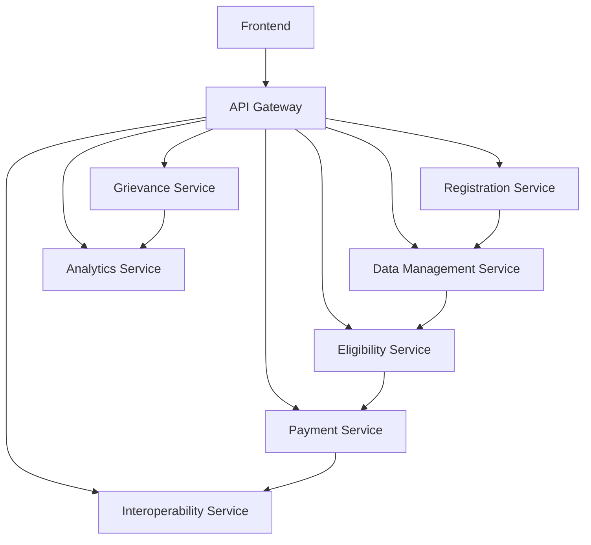
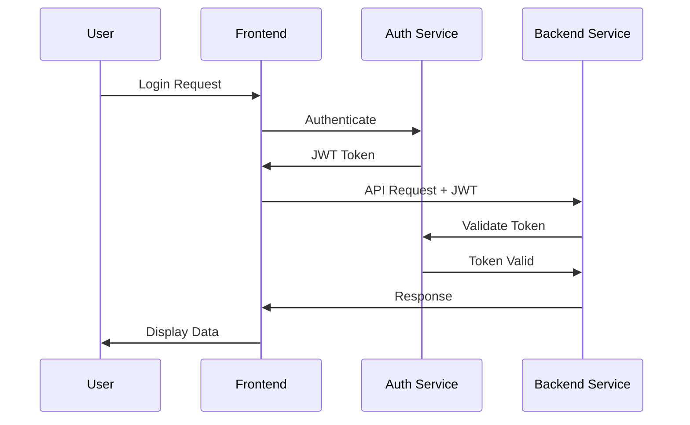

# DSR System Architecture Documentation

**Version:** 2.0  
**Date:** June 24, 2025  
**Status:** Production Ready  

## 🎯 Overview

The Dynamic Social Registry (DSR) is a comprehensive microservices-based platform designed to manage social protection programs in the Philippines. The system provides end-to-end functionality for household registration, eligibility assessment, payment processing, grievance management, and analytics.

## 🏗️ Architecture Principles

### Design Principles
1. **Microservices Architecture**: Loosely coupled, independently deployable services
2. **Domain-Driven Design**: Services organized around business domains
3. **API-First**: All services expose RESTful APIs
4. **Event-Driven**: Asynchronous communication through events
5. **Cloud-Native**: Containerized and Kubernetes-ready
6. **Security by Design**: JWT authentication and role-based access control

### Quality Attributes
- **Scalability**: Horizontal scaling of individual services
- **Reliability**: 99.9% uptime with fault tolerance
- **Performance**: Sub-2-second response times
- **Security**: End-to-end encryption and audit logging
- **Maintainability**: Clean code and comprehensive testing

## 🔧 System Components

### Backend Services (7 Microservices)

#### 1. Registration Service (Port 8080)
**Purpose**: Household registration and member management
- **Entities**: User, Household, HouseholdMember, Address, ContactInfo
- **Key Features**: Multi-step registration, validation, PhilSys integration
- **Database**: PostgreSQL with JPA/Hibernate
- **Authentication**: JWT with role-based access control

#### 2. Data Management Service (Port 8081)
**Purpose**: Data ingestion, validation, and PhilSys integration
- **Entities**: DataIngestionBatch, DataIngestionRecord, EconomicProfile
- **Key Features**: Data validation, deduplication, archiving, PhilSys API
- **Integration**: External PhilSys API, legacy system connectors
- **Processing**: Batch and real-time data processing

#### 3. Eligibility Service (Port 8082)
**Purpose**: PMT calculation and program eligibility assessment
- **Entities**: EligibilityAssessment, PMTCalculation, ProgramEligibility
- **Key Features**: PMT calculator, rules engine, program matching
- **Business Logic**: DSWD PMT formulas, eligibility criteria
- **Integration**: Data Management Service for household data

#### 4. Payment Service (Port 8083)
**Purpose**: Payment processing and FSP integration
- **Entities**: Payment, PaymentBatch, PaymentAuditLog, FSPConfiguration
- **Key Features**: Batch processing, FSP integration, reconciliation
- **FSP Support**: BDO, BPI, GCash, PayMaya, and other providers
- **Audit**: Comprehensive transaction logging and monitoring

#### 5. Interoperability Service (Port 8084)
**Purpose**: External system integration and API gateway
- **Entities**: ServiceDeliveryRecord, DataSharingAgreement, ExternalSystemConfiguration
- **Key Features**: API gateway, service delivery tracking, data sharing
- **Integration**: Government agencies, external systems
- **Security**: API rate limiting, authentication, authorization

#### 6. Grievance Service (Port 8085)
**Purpose**: Case management and grievance handling
- **Entities**: GrievanceCase, CaseActivity, CaseAssignment
- **Key Features**: Multi-channel filing, automated routing, SLA tracking
- **Workflow**: Case lifecycle management, escalation, resolution
- **Channels**: Web, mobile, phone, in-person

#### 7. Analytics Service (Port 8086)
**Purpose**: Reporting, dashboards, and business intelligence
- **Entities**: AnalyticsReport, Dashboard, KPIMetric
- **Key Features**: Real-time dashboards, custom reports, data export
- **Analytics**: Geospatial analysis, trend analysis, KPI calculation
- **Visualization**: Charts, graphs, maps, and interactive dashboards

### Frontend Application

#### Next.js 14+ Web Application (Port 3000)
**Technology Stack**:
- **Framework**: Next.js 14+ with App Router
- **Language**: TypeScript with strict mode
- **Styling**: Tailwind CSS with custom design system
- **State Management**: React Context and React Query
- **Forms**: React Hook Form with Zod validation
- **HTTP Client**: Axios with JWT interceptors
- **Testing**: Jest, React Testing Library, Playwright

**Key Features**:
- **Role-Based Dashboards**: Citizen, LGU Staff, DSWD Staff, Admin
- **Business Workflows**: Registration, eligibility, payments, grievances
- **Responsive Design**: Mobile-first, progressive web app
- **Real-Time Updates**: WebSocket integration for live data
- **Offline Capability**: Service worker for offline functionality

### Infrastructure Components

#### Database Layer
- **Primary Database**: PostgreSQL 16 with high availability
- **Caching**: Redis for session management and caching
- **Message Broker**: Apache Kafka for event streaming
- **Connection Pooling**: HikariCP for optimal database connections

#### Security Layer
- **Authentication**: JWT tokens with refresh mechanism
- **Authorization**: Role-based access control (RBAC)
- **Encryption**: TLS 1.3 for data in transit, AES-256 for data at rest
- **API Security**: Rate limiting, input validation, CORS protection

#### Monitoring and Observability
- **Metrics**: Prometheus for metrics collection
- **Visualization**: Grafana for dashboards and alerting
- **Logging**: Centralized logging with ELK stack
- **Tracing**: Distributed tracing for request flow analysis

## 🔄 Integration Patterns

### Service-to-Service Communication


### Data Flow Architecture
1. **Registration Flow**: Frontend → Registration Service → Data Management Service
2. **Eligibility Flow**: Data Management Service → Eligibility Service → Analytics Service
3. **Payment Flow**: Eligibility Service → Payment Service → External FSPs
4. **Grievance Flow**: Frontend → Grievance Service → Analytics Service
5. **Analytics Flow**: All Services → Analytics Service → Frontend Dashboards

### Event-Driven Architecture
- **Event Bus**: Apache Kafka for asynchronous messaging
- **Event Types**: HouseholdRegistered, EligibilityAssessed, PaymentProcessed
- **Event Sourcing**: Audit trail through event logging
- **CQRS**: Command Query Responsibility Segregation for read/write optimization

## 🔐 Security Architecture

### Authentication Flow


### Security Controls
- **Input Validation**: All inputs validated and sanitized
- **SQL Injection Prevention**: Parameterized queries and ORM
- **XSS Protection**: Content Security Policy and output encoding
- **CSRF Protection**: CSRF tokens and SameSite cookies
- **Rate Limiting**: API rate limiting to prevent abuse

## 📊 Performance Architecture

### Scalability Patterns
- **Horizontal Scaling**: Auto-scaling based on CPU/memory usage
- **Load Balancing**: NGINX with round-robin and health checks
- **Database Scaling**: Read replicas and connection pooling
- **Caching Strategy**: Multi-level caching (Redis, application, CDN)

### Performance Optimizations
- **Database Indexing**: Optimized indexes for query performance
- **Query Optimization**: Efficient JPA queries and pagination
- **Compression**: Gzip compression for API responses
- **CDN**: Content delivery network for static assets

## 🚀 Deployment Architecture

### Container Strategy
- **Base Images**: OpenJDK 17 for backend, Node.js 18 for frontend
- **Container Registry**: Private registry for image management
- **Image Scanning**: Security vulnerability scanning
- **Multi-Stage Builds**: Optimized container sizes

### Kubernetes Deployment
```yaml
# Example service deployment
apiVersion: apps/v1
kind: Deployment
metadata:
  name: dsr-registration-service
spec:
  replicas: 3
  selector:
    matchLabels:
      app: dsr-registration-service
  template:
    spec:
      containers:
      - name: registration-service
        image: dsr/registration-service:v1.0.0
        ports:
        - containerPort: 8080
        env:
        - name: SPRING_PROFILES_ACTIVE
          value: "production"
        resources:
          requests:
            memory: "512Mi"
            cpu: "250m"
          limits:
            memory: "1Gi"
            cpu: "500m"
```

### Environment Strategy
- **Development**: Local development with Docker Compose
- **Staging**: Kubernetes cluster with production-like configuration
- **Production**: High-availability Kubernetes cluster with monitoring

## 📈 Monitoring Architecture

### Observability Stack
- **Metrics Collection**: Prometheus with service discovery
- **Alerting**: Alertmanager with PagerDuty integration
- **Dashboards**: Grafana with custom DSR dashboards
- **Log Aggregation**: ELK stack with structured logging

### Key Metrics
- **Application Metrics**: Response times, error rates, throughput
- **Infrastructure Metrics**: CPU, memory, disk, network usage
- **Business Metrics**: Registration rates, payment volumes, case resolution
- **Security Metrics**: Failed login attempts, API abuse, security events

## 🔄 Data Architecture

### Database Design
- **Normalization**: 3NF with denormalization for performance
- **Partitioning**: Table partitioning for large datasets
- **Archiving**: Automated data archiving for historical records
- **Backup Strategy**: Daily backups with point-in-time recovery

### Data Integration
- **ETL Processes**: Extract, Transform, Load for legacy systems
- **Real-Time Sync**: Change data capture for real-time updates
- **Data Quality**: Validation rules and data cleansing
- **Master Data Management**: Single source of truth for reference data

## 📋 API Specifications

### RESTful API Design
- **HTTP Methods**: GET, POST, PUT, DELETE, PATCH
- **Status Codes**: Standard HTTP status codes
- **Content Type**: JSON for request/response bodies
- **Versioning**: URL versioning (e.g., /api/v1/)

### API Documentation
- **OpenAPI 3.0**: Comprehensive API specifications
- **Swagger UI**: Interactive API documentation at `/swagger-ui.html`
- **Postman Collections**: API testing collections
- **SDK Generation**: Auto-generated client SDKs

### Core API Endpoints

#### Registration Service (Port 8080)
```
POST /api/v1/auth/register          # User registration
POST /api/v1/auth/login             # User authentication
GET  /api/v1/auth/profile           # User profile
POST /api/v1/registrations          # Household registration
GET  /api/v1/registrations          # List registrations
GET  /api/v1/registrations/{id}     # Get registration details
PUT  /api/v1/registrations/{id}     # Update registration
```

#### Data Management Service (Port 8081)
```
POST /api/v1/data/ingest            # Data ingestion
POST /api/v1/data/validate          # Data validation
POST /api/v1/data/deduplicate       # Deduplication
POST /api/v1/data/philsys/verify    # PhilSys verification
GET  /api/v1/data/households/{id}   # Household data
```

#### Eligibility Service (Port 8082)
```
POST /api/v1/eligibility/assess     # Eligibility assessment
GET  /api/v1/eligibility/{id}       # Assessment results
POST /api/v1/eligibility/pmt        # PMT calculation
GET  /api/v1/eligibility/programs   # Available programs
```

#### Payment Service (Port 8083)
```
POST /api/v1/payments/batch         # Create payment batch
GET  /api/v1/payments               # List payments
GET  /api/v1/payments/{id}          # Payment details
POST /api/v1/payments/reconcile     # Reconciliation
```

## 🔧 Development Architecture

### Technology Stack Summary
| Component | Technology | Version |
|-----------|------------|---------|
| **Backend Framework** | Spring Boot | 3.2.x |
| **Java Version** | OpenJDK | 17 |
| **Database** | PostgreSQL | 16 |
| **Cache** | Redis | 7.x |
| **Message Broker** | Apache Kafka | 3.x |
| **Frontend Framework** | Next.js | 14+ |
| **Language** | TypeScript | 5.x |
| **Container Runtime** | Podman/Docker | Latest |
| **Orchestration** | Kubernetes | 1.25+ |

### Development Practices
- **Code Quality**: SonarQube for code analysis
- **Testing**: 80%+ test coverage requirement
- **CI/CD**: GitLab CI/CD with automated testing
- **Code Review**: Mandatory peer review process

---

**Document Status:** ✅ Production Ready  
**Architecture Review:** Approved  
**Last Updated:** June 24, 2025  
**Next Review:** September 24, 2025
